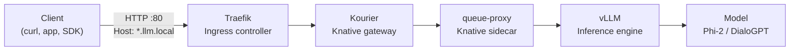

# LLM Production Deployment

Deploy and serve LLMs (Phi-2, DialoGPT-small) using **vLLM**, **KServe**, and **Knative** on a single-node k3s cluster with an OpenAI-compatible API.

## Quick Start

```bash
# Helm (recommended)
helm dependency update charts/model-deployment
helm upgrade --install model-deployment charts/model-deployment \
  --namespace llm-system --create-namespace --skip-schema-validation

# Or kubectl
make deploy
```

```bash
# Test
curl -s http://192.168.4.35/v1/chat/completions \
  -H "Host: vllm-phi2-predictor.llm-system.llm.local" \
  -H "Content-Type: application/json" \
  -d '{"model": "microsoft/phi-2", "messages": [{"role": "user", "content": "Hello"}], "max_tokens": 50}'
```

## Documentation

| Page | Description |
|---|---|
| [Getting Started](docs/getting-started.md) | Prerequisites, setup, first deployment |
| [Architecture](docs/architecture.md) | Request flow, resources, component interaction |
| [Technologies](docs/technologies.md) | vLLM, KServe, Knative, Traefik explained |
| [Deployment](docs/deployment.md) | Full guide (kubectl + Helm) |
| [API Reference](docs/api-reference.md) | Endpoints, parameters, testing |
| [Configuration](docs/configuration.md) | All `values.yaml` options |
| [Concepts](docs/concepts.md) | K8s and LLM concepts for beginners |
| [Glossary](docs/glossary.md) | Terms and definitions |

## Models

| InferenceService | Model | Params | Max Tokens |
|---|---|---|---|
| `vllm-dialogpt` | microsoft/DialoGPT-small | 117M | 1024 |
| `vllm-phi2` | microsoft/phi-2 | 2.7B | 2048 |

## Stack



**Technologies**: vLLM, KServe, Knative, Kourier, Traefik, Helm (bjw-s/app-template)
