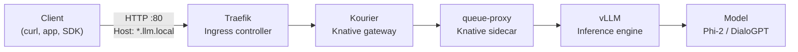

# LLM Production Deployment

Deploy and serve Large Language Models (LLMs) on a Kubernetes cluster using **vLLM**, **KServe**, and **Knative**. Provides an **OpenAI-compatible API** — works with any OpenAI SDK, curl, or custom application.

Current models: [Phi-2 (2.7B)](https://huggingface.co/microsoft/phi-2), [DialoGPT-small (117M)](https://huggingface.co/microsoft/DialoGPT-small)

---

## Architecture


```mermaid
flowchart LR
    Client["Client<br/>(curl, app, SDK)"] -->|"HTTP :80<br/>Host: *.llm.local"| T["Traefik<br/>Ingress controller"]
    T --> K["Kourier<br/>Knative gateway"]
    K --> QP["queue-proxy<br/>Knative sidecar"]
    QP --> V["vLLM<br/>Inference engine"]
    V --> M["Model<br/>Phi-2 / DialoGPT"]
```

**Layered architecture on Kubernetes:**

| Layer | Component | Role |
|---|---|---|
| Gateway | Traefik → Kourier | Ingress routing, hostname → revision mapping |
| Orchestration | KServe | Model lifecycle (InferenceService, ServingRuntime CRDs) |
| Serverless | Knative Serving | Autoscaling (scale-to-zero), revision management |
| Sidecar | queue-proxy | Concurrency limiting, metrics reporting |
| Inference | vLLM | High-performance LLM inference engine |
| Storage | PVC (model-cache) | Shared HuggingFace model weight cache |
| TLS | cert-manager | Automated certificate provisioning (optional) |
| Monitoring | Prometheus | Metrics scraping and alerting (optional) |

---

## Technologies

### vLLM
High-performance inference engine using **PagedAttention** to reduce KV cache memory waste by 60–80%. Runs on CPU via `substratusai/vllm:main-cpu`. Exposes an OpenAI-compatible API (`/v1/chat/completions`, `/v1/models`, `/health`).

### KServe
Kubernetes CRD framework for serving ML models. Defines models via `InferenceService` and runtimes via `ServingRuntime`. Automatically creates Knative Services, manages rolling updates, and handles health checking.

### Knative Serving
Serverless platform providing scale-to-zero, revision tracking (immutable snapshots per config change), traffic splitting, and concurrency-based autoscaling.

### Kourier
Lightweight Knative ingress gateway (Envoy-based) that routes by hostname to the correct Knative revision.

### cert-manager
Automates TLS certificate management. The chart optionally bootstraps a local CA issuer and distributes trust bundles for Knative internal TLS.

### bjw-s/app-template
General-purpose Helm chart that lets you define ConfigMaps, RBAC, PVCs, NetworkPolicies, ServiceMonitors, and raw Kubernetes resources declaratively in `values.yaml`.

---

## Prerequisites

| Requirement | Minimum Version |
|---|---|
| Kubernetes cluster | 1.28+ |
| Helm CLI | 3.x |
| kubectl | 1.28+ |
| Cluster resources | 8 CPU cores, 16 GB RAM |

---

## Installation

### 1. Install cert-manager

```bash
kubectl apply -f https://github.com/cert-manager/cert-manager/releases/download/v1.16.0/cert-manager.yaml
kubectl wait --for=condition=Available deployment -n cert-manager cert-manager cert-manager-cainjector cert-manager-webhook --timeout=120s
```

### 2. Install Knative Serving + Kourier

```bash
kubectl apply -f https://github.com/knative/serving/releases/download/knative-v1.21.2/serving-crds.yaml
kubectl apply -f https://github.com/knative/serving/releases/download/knative-v1.21.2/serving-core.yaml
kubectl apply -f https://github.com/knative-extensions/net-kourier/releases/download/knative-v1.21.0/kourier.yaml

# Configure Kourier as ingress class
kubectl patch configmap/config-network -n knative-serving \
  --type merge -p '{"data":{"ingress-class":"kourier.ingress.networking.knative.dev"}}'

# Configure Knative domain
kubectl patch configmap config-domain -n knative-serving \
  --type merge -p '{"data":{"llm.local":""}}'

# Enable PVC support (required for model cache)
kubectl patch configmap config-features -n knative-serving \
  --type merge -p '{"data":{"kubernetes.podspec-persistent-volume-claim":"enabled"}}'
kubectl patch configmap config-features -n knative-serving \
  --type merge -p '{"data":{"kubernetes.podspec-persistent-volume-write":"enabled"}}'
```

### 3. Install KServe

```bash
kubectl create namespace kserve
kubectl apply --server-side --force-conflicts \
  -f https://github.com/kserve/kserve/releases/download/v0.18.0/kserve.yaml
```

> **Note:** `--server-side --force-conflicts` is required because KServe CRDs exceed the 262KB annotation limit.

### 4. Deploy the Helm Chart

```bash
# Build Helm dependencies
helm dependency update charts/model-deployment

# Deploy to the cluster
helm upgrade --install model-deployment charts/model-deployment \
  --namespace llm-system --create-namespace
```

### 5. Verify Deployment

```bash
kubectl get inferenceservice -n llm-system
kubectl get pods -n llm-system -w
```

Wait for pods to reach `2/2 Running` (queue-proxy + kserve-container).

---

## Testing

```bash
# List available models
kubectl exec -n llm-system deploy/<predictor-deployment> -c kserve-container \
  -- curl -s http://localhost:8080/v1/models

# Test Phi-2 chat completion
curl -s http://192.168.4.35/v1/chat/completions \
  -H "Host: vllm-phi2-predictor.llm-system.llm.local" \
  -H "Content-Type: application/json" \
  -d '{"model": "microsoft/phi-2", "messages": [{"role": "user", "content": "Hello"}], "max_tokens": 50}'

# Test DialoGPT-small
curl -s http://192.168.4.35/v1/chat/completions \
  -H "Host: vllm-dialogpt-predictor.llm-system.llm.local" \
  -H "Content-Type: application/json" \
  -d '{"model": "microsoft/DialoGPT-small", "messages": [{"role": "user", "content": "Hello, how are you?"}], "max_tokens": 50}'
```

Or use `make test` after updating the `HOST` variable in the Makefile.

---

## Models

| InferenceService | Model | Parameters | Max Tokens | Storage |
|---|---|---|---|---|
| `vllm-dialogpt` | microsoft/DialoGPT-small | 117M | 1024 | HuggingFace |
| `vllm-phi2` | microsoft/phi-2 | 2.7B | 2048 | HuggingFace |

Models are downloaded from HuggingFace on first deploy and cached on the shared PVC.

---

## Project Structure

```
├── charts/model-deployment/     # Helm chart
│   ├── templates/               # Custom templates (cert-manager, KServe CRDs)
│   ├── Chart.yaml               # Chart metadata + bjw-s/app-template dependency
│   └── values.yaml              # All configuration (models, runtimes, certs)
├── k8s/                         # Raw Kubernetes manifests (kubectl deployment)
│   ├── cache/                   # Redis deployment
│   ├── configmaps/              # ConfigMaps, chat templates
│   ├── ingress/                 # Traefik IngressRoutes (HTTP + HTTPS)
│   ├── knative/                 # Knative services
│   ├── kserve/                  # InferenceService CRDs
│   ├── monitoring/              # Prometheus scraping config
│   ├── namespaces/              # Namespace definitions
│   ├── rbac/                    # RBAC rules
│   ├── secrets/                 # Secret definitions
│   ├── storage/                 # PersistentVolumeClaims
│   ├── tls/                     # ClusterIssuer, Certificate
│   └── vllm/                    # vLLM Deployments (GPU + CPU)
├── docs/                        # Documentation
├── Makefile                     # Automation (deploy, test, logs, cleanup)
└── README.md
```

---

## Cleanup

```bash
# Helm (if deployed via Helm)
helm uninstall model-deployment --namespace llm-system

# kubectl (if deployed via make)
make clean-all
```

---

## Documentation

| Page | Description |
|---|---|
| [Quick Start](docs/quick-start.md) | From fresh machine to running LLMs |
| [Getting Started](docs/getting-started.md) | Prerequisites, setup, first deployment |
| [Architecture](docs/architecture.md) | Request flow, component interaction, resources |
| [Technologies](docs/technologies.md) | Deep dive into each technology |
| [Deployment](docs/deployment.md) | Full deployment guide (Helm + kubectl) |
| [API Reference](docs/api-reference.md) | Endpoints, parameters, testing |
| [Configuration](docs/configuration.md) | All `values.yaml` options |
| [AI-Ops Integration](docs/ai-ops-integration.md) | Envoy AI Gateway integration |
| [Concepts](docs/concepts.md) | K8s and LLM concepts for beginners |
| [Glossary](docs/glossary.md) | Terms and definitions |
