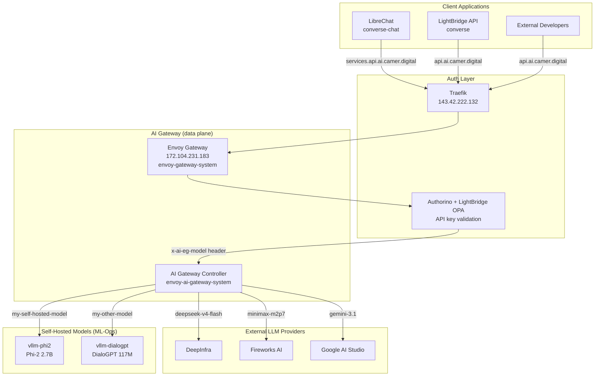
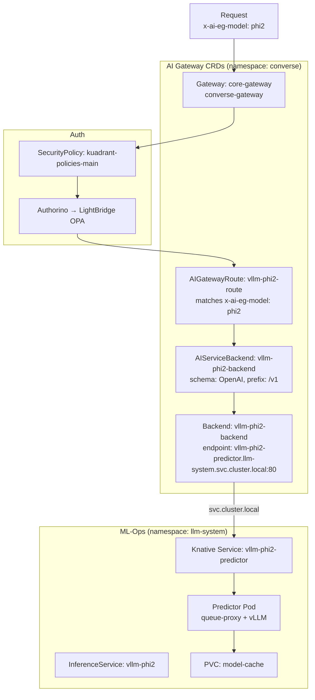

# AI-Ops Integration

Linking self-hosted LLMs (vLLM + KServe + Knative) to the Envoy AI Gateway infrastructure.

---

## Overview

The AI-Ops infrastructure uses **Envoy AI Gateway** as a centralized LLM routing layer. It sits between client applications (LibreChat, LightBridge API) and LLM providers (DeepInfra, Fireworks AI, Google AI Studio).

Self-hosted models deployed via our ML-Ops stack (vLLM + KServe + Knative) can integrate directly into this gateway, becoming available as new model options alongside external providers.



---

## AI-Ops Architecture

### Traffic Flow

```
Internet
    │
    ▼
[Traefik LoadBalancer]    143.42.222.132     Edge ingress (user-facing apps)
    │
    │  Hosts: ai.camer.digital, self-service.ai.camer.digital, ...
    │         mcp.ai.camer.digital, ...
    │
    ▼
[Envoy Gateway LB]        172.104.231.183    AI-specific API gateway
    │
    │  Hosts: api.ai.camer.digital (public API)
    │         services.api.ai.camer.digital (internal/service API)
    │
    ▼
[Authorino]                                External auth (API key validation)
    │
    ▼
[AIGatewayRoute]                           Model routing by x-ai-eg-model header
    │
    ├── DeepInfra (api.deepinfra.com)
    ├── Fireworks AI (api.fireworks.ai)
    ├── Google AI Studio
    └── [Your self-hosted model]
```

### Key Components

| Component | Namespace | Purpose |
|---|---|---|
| **Envoy Gateway** | `envoy-gateway-system` | Data-plane Envoy proxies that handle traffic |
| **AI Gateway Controller** | `envoy-ai-gateway-system` | Control-plane that reconciles AI CRDs |
| **Gateway + HTTPRoute** | `converse-gateway` | Gateway listeners (api-https, service-https) |
| **Authorino** | `converse-gateway` | External auth provider (API key validation) |
| **LightBridge OPA** | `converse` | Policy engine for API key authorization |
| **OTel Collectors** | `converse-gateway` | Tracing/phoenix + usage/lightbridge collectors |
| **Phoenix** | `converse-monitoring` | LLM observability (traces) |
| **Traefik** | `traefik-system` | Edge ingress for web applications |

### Gateway Listeners

| Listener | Host | Port | TLS | Purpose |
|---|---|---|---|---|
| `api-https` | `api.ai.camer.digital` | 443 | Yes | Public LLM API |
| `service-https` | `services.api.ai.camer.digital` | 443 | Yes | Internal/service LLM API |

### AI Gateway CRDs

| CRD | Purpose |
|---|---|
| `AIGatewayRoute` | Routes LLM requests to backends based on `x-ai-eg-model` header |
| `AIServiceBackend` | Wraps a Backend with an API schema (e.g., OpenAI) |
| `Backend` | Defines the actual endpoint (FQDN + port) |
| `BackendSecurityPolicy` | Attaches API keys to backend requests |
| `GatewayConfig` | Configures the AI Gateway (extProc, telemetry, logging) |
| `MCPRoute` | Routes MCP requests to MCP servers |
| `SecurityPolicy` | External auth configuration (Authorino) |
| `QuotaPolicy` | Rate limiting (defined but not yet used) |

---

## Current LLM Providers

| Backend | Provider | Schema | Prefix |
|---|---|---|---|
| `deepinfra-backend-01-svc` | DeepInfra | OpenAI | `/v1/openai` |
| `fw-backend-01-svc` | Fireworks AI | OpenAI | `/inference/v1` |
| `google-ai-studio-backend-01-svc` | Google AI Studio | OpenAI | `v1beta/openai` |

New models are added by creating a new `AIGatewayRoute` that matches the model name in `x-ai-eg-model` header points to one of these backends (or a new one).

---

## Adding a Self-Hosted Model

To make a vLLM + KServe model available through the AI Gateway, you need to create 3-4 custom resources.

### Prerequisites

- The model is already deployed via KServe InferenceService (e.g., `vllm-phi2` in `llm-system`)
- The model exposes an OpenAI-compatible API on a stable ClusterIP service
- The cluster has the Envoy AI Gateway CRDs installed

### Step 1: Create a Backend

The `Backend` resource defines where the model lives (the Kubernetes service URL):

```yaml
apiVersion: gateway.envoyproxy.io/v1alpha1
kind: Backend
metadata:
  name: vllm-phi2-backend
  namespace: converse
spec:
  endpoints:
    - fqdn:
        hostname: vllm-phi2-predictor.llm-system.svc.cluster.local
        port: 80
  type: Endpoints
```

> The hostname follows the pattern `{ksvc-name}.{namespace}.svc.cluster.local`. Knative creates a ClusterIP service for each InferenceService. Use `kubectl get ksvc -n llm-system` to find the exact service name.

### Step 2: Create an AIServiceBackend

The `AIServiceBackend` wraps the Backend with the OpenAI API schema (since vLLM serves an OpenAI-compatible API):

```yaml
apiVersion: aigateway.envoyproxy.io/v1alpha1
kind: AIServiceBackend
metadata:
  name: vllm-phi2-backend
  namespace: converse
spec:
  backendRef:
    group: gateway.envoyproxy.io
    kind: Backend
    name: vllm-phi2-backend
  schema:
    name: OpenAI
    prefix: /v1
```

| Field | Value | Why |
|---|---|---|
| `schema.name` | `OpenAI` | vLLM serves an OpenAI-compatible API |
| `schema.prefix` | `/v1` | vLLM endpoints are under `/v1/...` |

### Step 3: Create an AIGatewayRoute (Optional)

If you want the model to be discoverable by model name, add an `AIGatewayRoute`. This maps the `x-ai-eg-model` header value to this backend:

```yaml
apiVersion: aigateway.envoyproxy.io/v1alpha1
kind: AIGatewayRoute
metadata:
  name: vllm-phi2-route
  namespace: converse
spec:
  llmRequestCosts:
    - metadataKey: llm_input_token
      type: InputToken
    - metadataKey: llm_output_token
      type: OutputToken
    - metadataKey: llm_total_token
      type: TotalToken
  parentRefs:
    - group: gateway.networking.k8s.io
      kind: Gateway
      name: core-gateway
      namespace: converse-gateway
  rules:
    - backendRefs:
        - name: vllm-phi2-backend
          priority: 0
          weight: 1
      matches:
        - headers:
            - name: x-ai-eg-model
              type: Exact
              value: phi2
      modelsOwnedBy: GIS AI Models
```

| Field | Value | Meaning |
|---|---|---|
| `parentRefs` | `core-gateway` in `converse-gateway` | Attaches to the main AI Gateway |
| `rules[].matches[].headers` | `x-ai-eg-model: phi2` | Triggers when this header matches |
| `rules[].backendRefs[].name` | `vllm-phi2-backend` | Routes to this AIServiceBackend |
| `modelsOwnedBy` | `GIS AI Models` | Label for organization/grouping |

### Step 4: Add BackendSecurityPolicy (If Needed)

If the model requires an API key for authentication:

```yaml
apiVersion: aigateway.envoyproxy.io/v1alpha1
kind: BackendSecurityPolicy
metadata:
  name: vllm-phi2-security
  namespace: converse
spec:
  apiKey:
    secretRef:
      name: vllm-phi2-api-key
  targetRefs:
    - group: aigateway.envoyproxy.io
      kind: AIServiceBackend
      name: vllm-phi2-backend
  type: APIKey
```

For internal (in-cluster) models without authentication, this step can be skipped.

---

## Adding DialoGPT (Second Model)

The same pattern applies for additional models. Here is the minimal set:

```yaml
# Backend
apiVersion: gateway.envoyproxy.io/v1alpha1
kind: Backend
metadata:
  name: vllm-dialogpt-backend
  namespace: converse
spec:
  endpoints:
    - fqdn:
        hostname: vllm-dialogpt-predictor.llm-system.svc.cluster.local
        port: 80
  type: Endpoints
---
# AIServiceBackend
apiVersion: aigateway.envoyproxy.io/v1alpha1
kind: AIServiceBackend
metadata:
  name: vllm-dialogpt-backend
  namespace: converse
spec:
  backendRef:
    group: gateway.envoyproxy.io
    kind: Backend
    name: vllm-dialogpt-backend
  schema:
    name: OpenAI
    prefix: /v1
---
# AIGatewayRoute
apiVersion: aigateway.envoyproxy.io/v1alpha1
kind: AIGatewayRoute
metadata:
  name: vllm-dialogpt-route
  namespace: converse
spec:
  parentRefs:
    - group: gateway.networking.k8s.io
      kind: Gateway
      name: core-gateway
      namespace: converse-gateway
  rules:
    - backendRefs:
        - name: vllm-dialogpt-backend
          priority: 0
          weight: 1
      matches:
        - headers:
            - name: x-ai-eg-model
              type: Exact
              value: dialogpt
      modelsOwnedBy: GIS AI Models
```

---

## Verifying the Integration

### 1. Check that the resources are created

```bash
kubectl get backend -n converse
kubectl get aiservicebackend -n converse
kubectl get aigatewayroute -n converse
```

### 2. Test the model through the AI Gateway

```bash
# Replace with the actual LoadBalancer IP/domain
GATEWAY_HOST=api.ai.camer.digital

curl -s https://$GATEWAY_HOST/v1/chat/completions \
  -H "Content-Type: application/json" \
  -H "Authorization: Bearer <your-api-key>" \
  -H "x-ai-eg-model: phi2" \
  -d '{
    "model": "microsoft/phi-2",
    "messages": [{"role": "user", "content": "Hello"}],
    "max_tokens": 50
  }'
```

### 3. Make the model available in LibreChat

Once the AIGatewayRoute is created, users can select the new model in LibreChat. The model name `phi2` will show up in the model selector if LibreChat discovers available models via the `/v1/models` endpoint.

Alternatively, add it manually in the LibreChat config:

```yaml
# In the librechat-config ConfigMap
endpoints:
  custom:
    - name: Converse
      apiKey: ${CONVERSE_OPENAI_API_KEY}
      baseURL: https://services.api.ai.camer.digital/v1
      models:
        default: [phi2, dialogpt, glm-5, minimax-m2p7]
```

---

## Complete Resource Relationship



---

## Differences from External Providers

| Aspect | External (DeepInfra) | Self-Hosted (vLLM) |
|---|---|---|
| **Latency** | Network round-trip + provider inference | In-cluster, lower latency |
| **Cost** | Pay per token | Fixed infrastructure cost |
| **Auth** | API key from provider | Cluster internal (or API key) |
| **Schema** | OpenAI | OpenAI (vLLM) |
| **Scalability** | Provider-managed | Knative autoscaling (min/max pods) |
| **Availability** | Dependent on provider | Dependent on cluster resources |
| **Data residency** | External | In-cluster |

---

## Troubleshooting

### Model not reachable

```bash
# Check the Knative service exists
kubectl get ksvc -n llm-system

# Verify DNS resolution inside the cluster
kubectl run -it --rm debug --image=busybox -- nslookup vllm-phi2-predictor.llm-system.svc.cluster.local

# Check the Gateway has the route attached
kubectl describe gateway core-gateway -n converse-gateway
```

### AIGatewayRoute not matching

```bash
# Verify the header match is correct
kubectl get aigatewayroute vllm-phi2-route -n converse -o yaml

# Check the route status
kubectl get aigatewayroute vllm-phi2-route -n converse -o jsonpath='{.status}'
```

### Auth errors

```bash
# Check the SecurityPolicy
kubectl get securitypolicy kuadrant-policies-main -n converse-gateway -o yaml

# Check Authorino logs
kubectl logs -n converse-gateway deploy/kuadrant-policies-main --tail=50
```

---

## Related

- [Architecture](architecture.md) — ML-Ops architecture (request flow, resources)
- [Technologies](technologies.md) — vLLM, KServe, Knative, Traefik explained
- [Deployment](deployment.md) — Deploying the ML-Ops stack
- [Getting Started](getting-started.md) — First deployment guide
