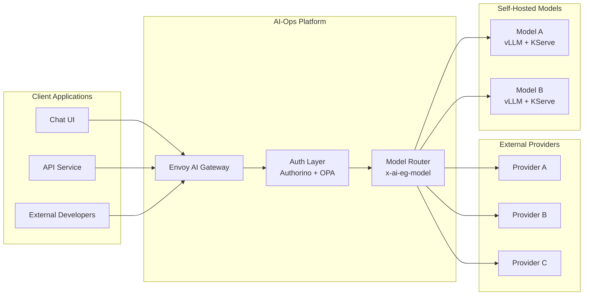
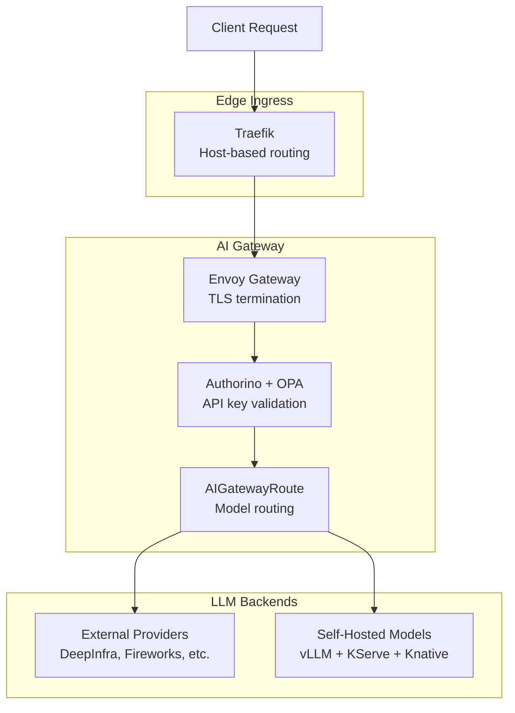
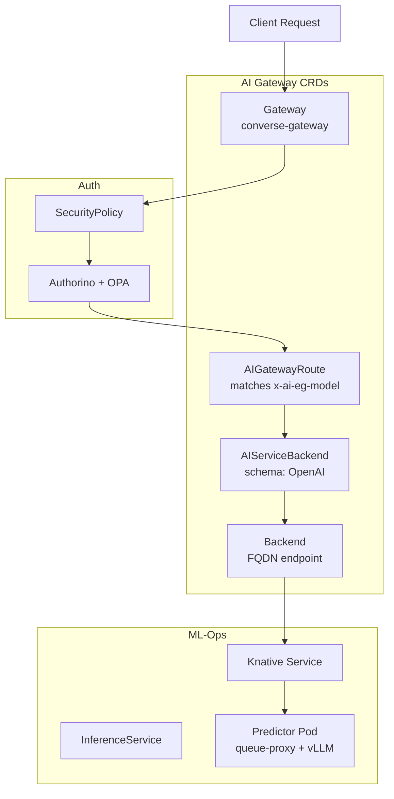

# AI-Ops Integration

Linking self-hosted LLMs (vLLM + KServe + Knative) to the Envoy AI Gateway infrastructure.

---

## Overview

The AI-Ops infrastructure uses **Envoy AI Gateway** as a centralized LLM routing layer. It sits between client applications and LLM providers (external + self-hosted).

Self-hosted models deployed via our ML-Ops stack integrate directly into this gateway, becoming available as new model options alongside external providers.



---

## Architecture

### Traffic Flow



### Key Components

| Component | Namespace | Purpose |
|---|---|---|
| **Traefik** | `traefik-system` | Edge ingress, routes by hostname |
| **Envoy Gateway** | `envoy-gateway-system` | Data-plane Envoy proxies |
| **AI Gateway Controller** | `envoy-ai-gateway-system` | Control-plane for AI CRDs |
| **Gateway** | `converse-gateway` | TLS listeners, route attachment |
| **Authorino** | `converse-gateway` | External auth (API key validation) |
| **LightBridge OPA** | `converse` | Policy engine for authorization |
| **OTel Collectors** | `converse-gateway` | Tracing + usage/cost telemetry |
| **Phoenix** | `converse-monitoring` | LLM observability (traces) |

### Gateway Listeners

| Listener | Host | Port | TLS | Purpose |
|---|---|---|---|---|
| `api-https` | `api.<domain>` | 443 | Yes | Public LLM API |
| `service-https` | `services.<domain>` | 443 | Yes | Internal/service LLM API |

### AI Gateway CRDs

| CRD | Purpose |
|---|---|
| `AIGatewayRoute` | Routes LLM requests to backends based on `x-ai-eg-model` header |
| `AIServiceBackend` | Wraps a Backend with an API schema (e.g., OpenAI) |
| `Backend` | Defines the actual endpoint (FQDN + port) |
| `BackendSecurityPolicy` | Attaches API keys to backend requests |
| `GatewayConfig` | Configures the AI Gateway (extProc, telemetry, logging) |
| `MCPRoute` | Routes MCP requests to MCP servers |
| `SecurityPolicy` | External auth configuration (Authorino) |
| `QuotaPolicy` | Rate limiting |

---

## Adding a Self-Hosted Model

To make a vLLM + KServe model available through the AI Gateway, create 3-4 custom resources.

### Prerequisites

- Model deployed via KServe InferenceService in any namespace
- Model exposes an OpenAI-compatible API on a stable ClusterIP service
- Cluster has the Envoy AI Gateway CRDs installed

### Step 1: Create a Backend

Points to the model's Knative service DNS:

```yaml
apiVersion: gateway.envoyproxy.io/v1alpha1
kind: Backend
metadata:
  name: my-model-backend
  namespace: converse
spec:
  endpoints:
    - fqdn:
        hostname: <ksvc-name>.<namespace>.svc.cluster.local
        port: 80
  type: Endpoints
```

The hostname follows `{ksvc-name}.{namespace}.svc.cluster.local`. Find the exact name with `kubectl get ksvc -n <namespace>`.

### Step 2: Create an AIServiceBackend

Wraps the Backend with the OpenAI schema (vLLM serves an OpenAI-compatible API):

```yaml
apiVersion: aigateway.envoyproxy.io/v1alpha1
kind: AIServiceBackend
metadata:
  name: my-model-backend
  namespace: converse
spec:
  backendRef:
    group: gateway.envoyproxy.io
    kind: Backend
    name: my-model-backend
  schema:
    name: OpenAI
    prefix: /v1
```

### Step 3: Create an AIGatewayRoute

Maps the `x-ai-eg-model` header value to this backend:

```yaml
apiVersion: aigateway.envoyproxy.io/v1alpha1
kind: AIGatewayRoute
metadata:
  name: my-model-route
  namespace: converse
spec:
  llmRequestCosts:
    - metadataKey: llm_input_token
      type: InputToken
    - metadataKey: llm_output_token
      type: OutputToken
    - metadataKey: llm_total_token
      type: TotalToken
  parentRefs:
    - group: gateway.networking.k8s.io
      kind: Gateway
      name: core-gateway
      namespace: converse-gateway
  rules:
    - backendRefs:
        - name: my-model-backend
          priority: 0
          weight: 1
      matches:
        - headers:
            - name: x-ai-eg-model
              type: Exact
              value: my-model-name
      modelsOwnedBy: GIS AI Models
```

### Step 4: Add BackendSecurityPolicy (Optional)

For models that require an API key:

```yaml
apiVersion: aigateway.envoyproxy.io/v1alpha1
kind: BackendSecurityPolicy
metadata:
  name: my-model-security
  namespace: converse
spec:
  apiKey:
    secretRef:
      name: my-model-api-key
  targetRefs:
    - group: aigateway.envoyproxy.io
      kind: AIServiceBackend
      name: my-model-backend
  type: APIKey
```

For internal (in-cluster) models without authentication, this step can be skipped.

---

## Adding Additional Models

Apply the same pattern for each model:

```yaml
# Backend
apiVersion: gateway.envoyproxy.io/v1alpha1
kind: Backend
metadata:
  name: another-model-backend
  namespace: converse
spec:
  endpoints:
    - fqdn:
        hostname: <another-ksvc-name>.<namespace>.svc.cluster.local
        port: 80
  type: Endpoints
---
# AIServiceBackend
apiVersion: aigateway.envoyproxy.io/v1alpha1
kind: AIServiceBackend
metadata:
  name: another-model-backend
  namespace: converse
spec:
  backendRef:
    group: gateway.envoyproxy.io
    kind: Backend
    name: another-model-backend
  schema:
    name: OpenAI
    prefix: /v1
---
# AIGatewayRoute
apiVersion: aigateway.envoyproxy.io/v1alpha1
kind: AIGatewayRoute
metadata:
  name: another-model-route
  namespace: converse
spec:
  parentRefs:
    - group: gateway.networking.k8s.io
      kind: Gateway
      name: core-gateway
      namespace: converse-gateway
  rules:
    - backendRefs:
        - name: another-model-backend
          priority: 0
          weight: 1
      matches:
        - headers:
            - name: x-ai-eg-model
              type: Exact
              value: another-model-name
      modelsOwnedBy: GIS AI Models
```

---

## Verifying the Integration

```bash
# Check resources are created
kubectl get backend -n converse
kubectl get aiservicebackend -n converse
kubectl get aigatewayroute -n converse

# Test the model through the AI Gateway
curl -s https://<gateway-host>/v1/chat/completions \
  -H "Content-Type: application/json" \
  -H "Authorization: Bearer <your-api-key>" \
  -H "x-ai-eg-model: my-model-name" \
  -d '{
    "model": "<model-id>",
    "messages": [{"role": "user", "content": "Hello"}],
    "max_tokens": 50
  }'
```

Once the AIGatewayRoute is created, users can select the model in the chat UI. The model name (`my-model-name`) appears in the model selector when the client discovers available models via `/v1/models`.

---

## Complete Resource Relationship



---

## Differences: External vs Self-Hosted

| Aspect | External Provider | Self-Hosted (vLLM) |
|---|---|---|
| **Latency** | Network round-trip | In-cluster, lower |
| **Cost** | Per-token pricing | Fixed infrastructure |
| **Auth** | Provider API key | Cluster internal or API key |
| **Schema** | Provider-specific | OpenAI (vLLM) |
| **Scalability** | Provider-managed | Knative autoscaling |
| **Availability** | Dependent on provider | Dependent on cluster |
| **Data residency** | External | In-cluster |

---

## Troubleshooting

### Model not reachable

```bash
# Check Knative service
kubectl get ksvc -n <namespace>

# Verify DNS inside the cluster
kubectl run -it --rm debug --image=busybox -- nslookup <ksvc-name>.<namespace>.svc.cluster.local

# Check Gateway has the route attached
kubectl describe gateway core-gateway -n converse-gateway
```

### AIGatewayRoute not matching

```bash
# Verify header match
kubectl get aigatewayroute <name> -n converse -o yaml

# Check route status
kubectl get aigatewayroute <name> -n converse -o jsonpath='{.status}'
```

### Auth errors

```bash
# Check SecurityPolicy
kubectl get securitypolicy -n converse-gateway -o yaml

# Check Authorino logs
kubectl logs -n converse-gateway deploy/kuadrant-policies-main --tail=50
```

---

## Related

- [Architecture](architecture.md) — ML-Ops architecture
- [Technologies](technologies.md) — vLLM, KServe, Knative, Traefik explained
- [Deployment](deployment.md) — Deploying the ML-Ops stack
