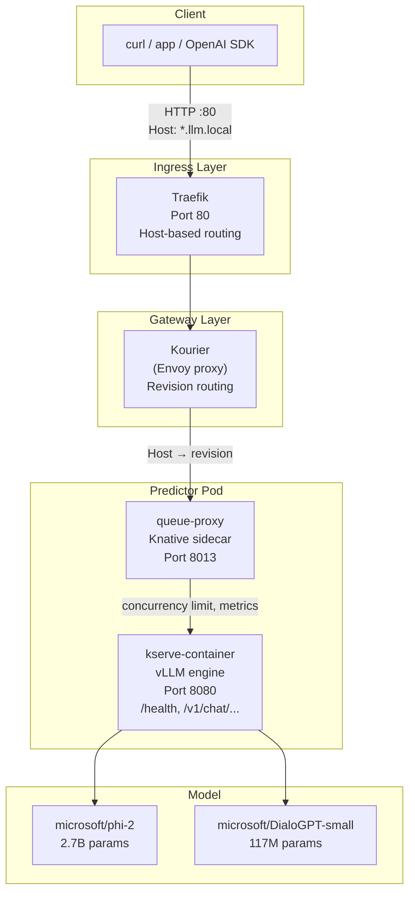
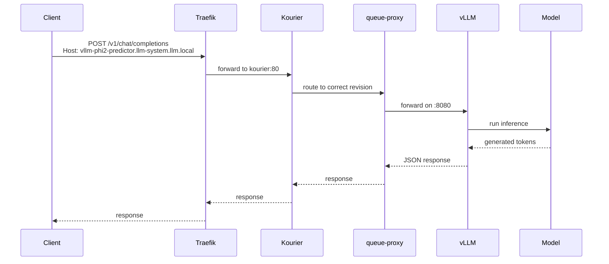
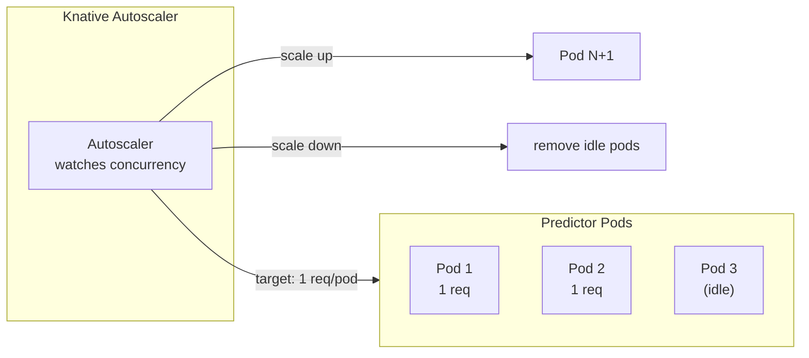
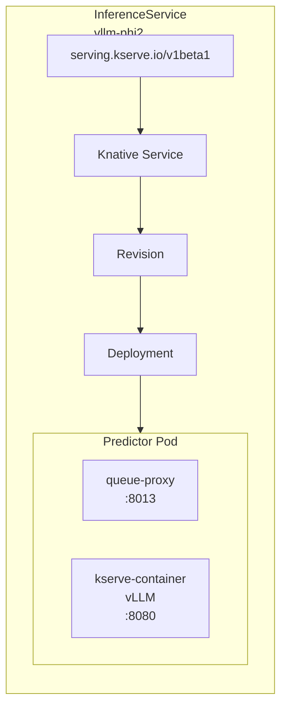
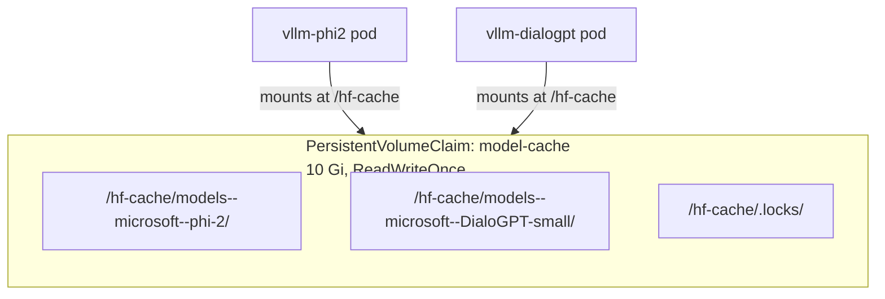
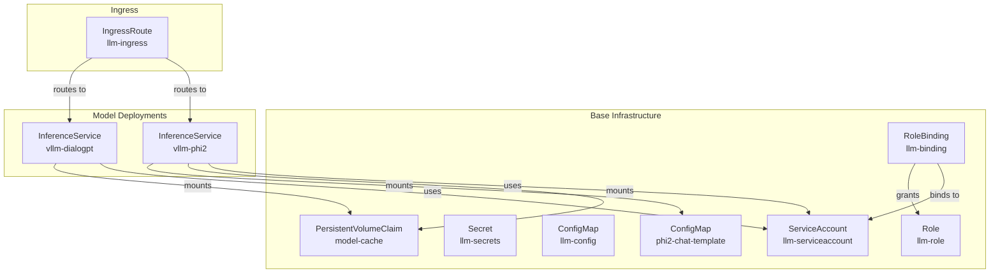

# Architecture

This document explains how the system is built, how components interact, and how a request travels from your client to the model and back.

---

## High-Level Overview

The system is a **layered architecture** on Kubernetes. Each layer handles a different concern:

1. **Ingress Layer** (Traefik) — Entry point for all HTTP traffic
2. **Gateway Layer** (Kourier) — Knative internal routing
3. **Orchestration Layer** (KServe) — Manages model lifecycle
4. **Serverless Layer** (Knative) — Autoscaling and revisions
5. **Inference Layer** (vLLM) — Runs the actual model



---

## Request Flow (Step by Step)



### Step 1: Client sends a request

The client sends an HTTP request to the cluster IP on port 80. The `Host` header selects the model:

```
POST /v1/chat/completions
Host: vllm-phi2-predictor.llm-system.llm.local
```

### Step 2: Traefik receives the request

Traefik is the Kubernetes **Ingress Controller** (built into k3s). An `IngressRoute` resource tells it:

```yaml
- match: Host(`vllm-phi2-predictor.llm-system.llm.local`)
  services:
    - name: kourier
      namespace: kourier-system
      port: 80
```

Traefik forwards to the **Kourier** service. No TLS termination or load balancing is needed at this level since all routing is host-based.

> **Why Traefik?** k3s includes Traefik by default. It handles host-based routing, TLS termination, and load balancing.

### Step 3: Kourier routes to the right revision

Kourier is Knative's networking gateway (built on Envoy). It maintains a routing table mapping hostnames to the current active **revision** of each Knative service.

Knative creates a new revision every time the InferenceService configuration changes (e.g., model version, resource limits). Kourier ensures traffic always reaches the correct revision.

> **Why Kourier?** It handles Knative-specific routing (revision-based traffic splitting, canary deployments) that a standard ingress cannot.

### Step 4: queue-proxy receives the request

Each predictor pod has a **queue-proxy** sidecar (injected by Knative). It:

- Limits concurrent requests (default: 100)
- Reports metrics to the Knative autoscaler
- Aggregates health checks from the kserve-container
- Buffers requests during scaling events

> **Why queue-proxy?** It decouples autoscaling from the application. The model container does not need to know about scaling.

### Step 5: vLLM processes the request

The **kserve-container** runs the vLLM inference engine:

1. **Tokenizes** input text (words → numbers)
2. **Runs inference** on the transformer model (CPU)
3. **Decodes** output (numbers → words)
4. Returns an OpenAI-compatible JSON response

> **Why vLLM?** PagedAttention reduces memory waste by 60-80%, enabling larger batches and higher throughput.

### Step 6: Response flows back

The response travels the reverse path: vLLM → queue-proxy → Kourier → Traefik → Client.

---

## Autoscaling



Configured via annotations on the InferenceService:

```yaml
annotations:
  autoscaling.knative.dev/minScale: "1"    # Never below 1 pod
  autoscaling.knative.dev/maxScale: "3"    # Never above 3 pods
  autoscaling.knative.dev/target: "1"      # 1 concurrent req per pod
```

- **minScale: 1** — Always keep one pod running (no cold starts)
- **maxScale: 3** — Limit cost and resource usage
- **target: 1** — When a pod handles 1 request, the autoscaler adds another

---

## Model Deployment

Each model is defined as an **InferenceService**:



```yaml
apiVersion: serving.kserve.io/v1beta1
kind: InferenceService
metadata:
  name: vllm-phi2
spec:
  predictor:
    serviceAccountName: llm-serviceaccount
    containers:
      - name: kserve-container
        image: substratusai/vllm:main-cpu
        args: ["--model", "microsoft/phi-2", ...]
        ports:
          - containerPort: 8080
            name: http1
        resources:
          requests:
            cpu: "4"
            memory: "8Gi"
        volumeMounts:
          - name: hf-cache
            mountPath: /hf-cache
          - name: chat-template
            mountPath: /chat-template
    volumes:
      - name: hf-cache
        persistentVolumeClaim:
          claimName: model-cache
      - name: chat-template
        configMap:
          name: phi2-chat-template
```

### Key details:

- **port named `http1`** — Forces HTTP/1.1 (Knative defaults to HTTP/2, which can cause issues with older clients)
- **Shared PVC** — Both models share `model-cache` to avoid downloading weights twice
- **Custom chat template** — Phi-2 needs a Jinja2 template for chat formatting
- **Probes** — Startup, readiness, and liveness probes ensure the pod only receives traffic when healthy

---

## Storage



The PVC uses `ReadWriteOnce` (one writer at a time). On a single-node cluster, both pods share the same volume.

---

## Resources Deployed

The Helm chart creates 10 Kubernetes resources. Here is what each one does and why it exists.

### 1. ServiceAccount: `llm-serviceaccount`

```yaml
apiVersion: v1
kind: ServiceAccount
metadata:
  name: llm-serviceaccount
  namespace: llm-system
```

**Purpose**: Gives the model pods a verifiable identity inside Kubernetes.

When a pod runs with this ServiceAccount, it can authenticate to the Kubernetes API using a mounted token. Without a ServiceAccount, the pod would use the `default` ServiceAccount (which may have excessive or insufficient permissions).

### 2. Secret: `llm-secrets`

```yaml
apiVersion: v1
kind: Secret
metadata:
  name: llm-secrets
  namespace: llm-system
type: Opaque
stringData:
  REDIS_PASSWORD: llm_cache_password
  HUGGINGFACE_TOKEN: ""
```

**Purpose**: Stores sensitive data that should not be hardcoded in configuration files or container images.

| Key | Value | Why |
|---|---|---|
| `REDIS_PASSWORD` | `llm_cache_password` | Authentication for optional Redis cache |
| `HUGGINGFACE_TOKEN` | (empty, fill as needed) | Required for gated/proprietary HuggingFace models |

Secrets are base64-encoded in Kubernetes and can be mounted as files or environment variables. They are never logged or exposed by Kubernetes.

### 3. ConfigMap: `llm-config`

```yaml
apiVersion: v1
kind: ConfigMap
metadata:
  name: llm-config
  namespace: llm-system
data:
  MODEL_NAME: microsoft/phi-2
  TENSOR_PARALLEL_SIZE: "1"
  GPU_MEMORY_UTILIZATION: "0.85"
  MAX_NUM_BATCHED_TOKENS: "8192"
  MAX_NUM_SEQS: "256"
```

**Purpose**: Stores non-sensitive configuration as key-value pairs that can be injected into pods as environment variables or files.

| Key | Value | Meaning |
|---|---|---|
| `MODEL_NAME` | `microsoft/phi-2` | Default model identifier |
| `TENSOR_PARALLEL_SIZE` | `1` | GPU parallelism (1 = CPU mode, no parallelism) |
| `GPU_MEMORY_UTILIZATION` | `0.85` | Max GPU memory fraction (unused on CPU) |
| `MAX_NUM_BATCHED_TOKENS` | `8192` | Max tokens across all batched requests |
| `MAX_NUM_SEQS` | `256` | Max concurrent sequences |

### 4. ConfigMap: `phi2-chat-template`

```yaml
apiVersion: v1
kind: ConfigMap
metadata:
  name: phi2-chat-template
  namespace: llm-system
data:
  chat_template.jinja: |
    
    
    User: {{ message['content'] }}
    ...
```

**Purpose**: Provides a custom Jinja2 chat template for Phi-2 (which lacks a built-in one).

Phi-2 was not pre-trained with a chat format, so we define how to convert OpenAI-style messages (`role`: `user`/`assistant`/`system`) into Phi-2's expected plain-text format. Mounted at `/chat-template/chat_template.jinja` and passed to vLLM via `--chat-template`.

### 5. PersistentVolumeClaim: `model-cache`

```yaml
apiVersion: v1
kind: PersistentVolumeClaim
metadata:
  name: model-cache
  namespace: llm-system
spec:
  accessModes:
    - ReadWriteOnce
  resources:
    requests:
      storage: 10Gi
```

**Purpose**: Provides persistent storage for downloaded HuggingFace model weights.

Without this, each pod would download the model (several GB) on every restart. The PVC caches the weights at `/hf-cache`, so subsequent pod starts are nearly instant.

### 6. Role: `llm-role`

```yaml
apiVersion: rbac.authorization.k8s.io/v1
kind: Role
metadata:
  name: llm-role
  namespace: llm-system
rules:
  - apiGroups: [""]
    resources: ["endpoints", "pods", "services"]
    verbs: ["get", "list", "watch"]
```

**Purpose**: Defines a set of permissions (a policy) scoped to the `llm-system` namespace.

| Permission | Why Needed |
|---|---|
| `get`/`list`/`watch` `endpoints` | Service discovery for the model to find other services |
| `get`/`list`/`watch` `pods` | The model checks pod status and health |
| `get`/`list`/`watch` `services` | Networking and routing information |

### 7. RoleBinding: `llm-binding`

```yaml
apiVersion: rbac.authorization.k8s.io/v1
kind: RoleBinding
metadata:
  name: llm-binding
  namespace: llm-system
subjects:
  - kind: ServiceAccount
    name: llm-serviceaccount
    namespace: llm-system
roleRef:
  kind: Role
  name: llm-role
  apiGroup: rbac.authorization.k8s.io
```

**Purpose**: Attaches the `llm-role` permissions to the `llm-serviceaccount`.

A Role alone does nothing — it is just a definition. The RoleBinding is what actually grants those permissions to a specific identity (the ServiceAccount). This follows the principle of **least privilege**: the model pods get exactly the permissions they need and nothing more.

### 8. InferenceService: `vllm-phi2`

```yaml
apiVersion: serving.kserve.io/v1beta1
kind: InferenceService
metadata:
  name: vllm-phi2
spec:
  predictor:
    containers:
      - name: kserve-container
        image: substratusai/vllm:main-cpu
        args: ["--model", "microsoft/phi-2", "--max-model-len", "2048"]
```

**Purpose**: Defines the Phi-2 model deployment. KServe watches this resource and creates the underlying Knative Service, Revision, Deployment, and Pods automatically.

| Parameter | Value |
|---|---|
| Model | `microsoft/phi-2` (2.7B params) |
| Max tokens | 2048 |
| Chat template | Custom Jinja2 (from `phi2-chat-template` ConfigMap) |
| CPU request/limit | 4 / 8 cores |
| Memory request/limit | 8 Gi / 16 Gi |

### 9. InferenceService: `vllm-dialogpt`

Same structure as `vllm-phi2` but:

| Parameter | Value |
|---|---|
| Model | `microsoft/DialoGPT-small` (117M params) |
| Max tokens | 1024 |
| Chat template | Built-in (none needed) |
| CPU request/limit | 4 / 8 cores |
| Memory request/limit | 8 Gi / 16 Gi |

### 10. IngressRoute: `llm-ingress`

```yaml
apiVersion: traefik.io/v1alpha1
kind: IngressRoute
metadata:
  name: llm-ingress
spec:
  entryPoints:
    - web
  routes:
    - match: Host(`vllm-phi2-predictor.llm-system.llm.local`)
      services:
        - name: kourier
          namespace: kourier-system
          port: 80
    - match: Host(`vllm-dialogpt-predictor.llm-system.llm.local`)
      services:
        - name: kourier
          namespace: kourier-system
          port: 80
```

**Purpose**: Defines Traefik routing rules. Tells Traefik to accept requests for two hostnames and forward them to the Kourier service.

Both hostnames route to the **same Kourier service**. Kourier then uses the `Host` header to determine which Knative Service (and thus which model) should handle the request.

### Resource Relationship Diagram



---

## Security

| Resource | Purpose |
|---|---|
| ServiceAccount `llm-serviceaccount` | Identity for the pods |
| Role `llm-role` | Permissions: get/list/watch pods, endpoints, services |
| RoleBinding `llm-binding` | Binds the Role to the ServiceAccount |
| Secret `llm-secrets` | Holds Redis password and HuggingFace token |

The principle of **least privilege** is applied: the service account only has read access to the resources it needs (pods, endpoints, services) and nothing else.

---

## Next Steps

- [Learn about each technology](technologies.md) in detail
- [Deploy the system](deployment.md) step by step
- [Explore configuration options](configuration.md)
- [Integrate with AI-Ops (Envoy AI Gateway)](ai-ops-integration.md)
