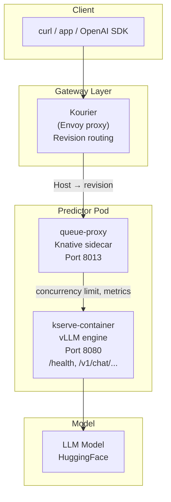
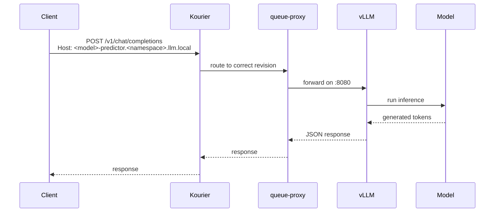
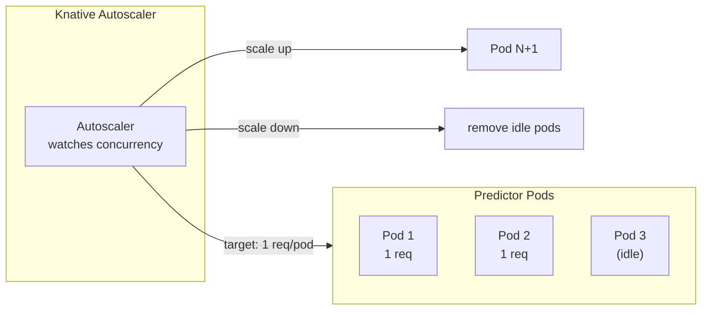
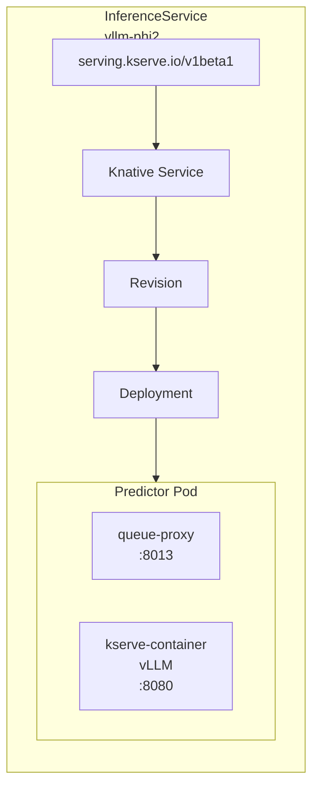
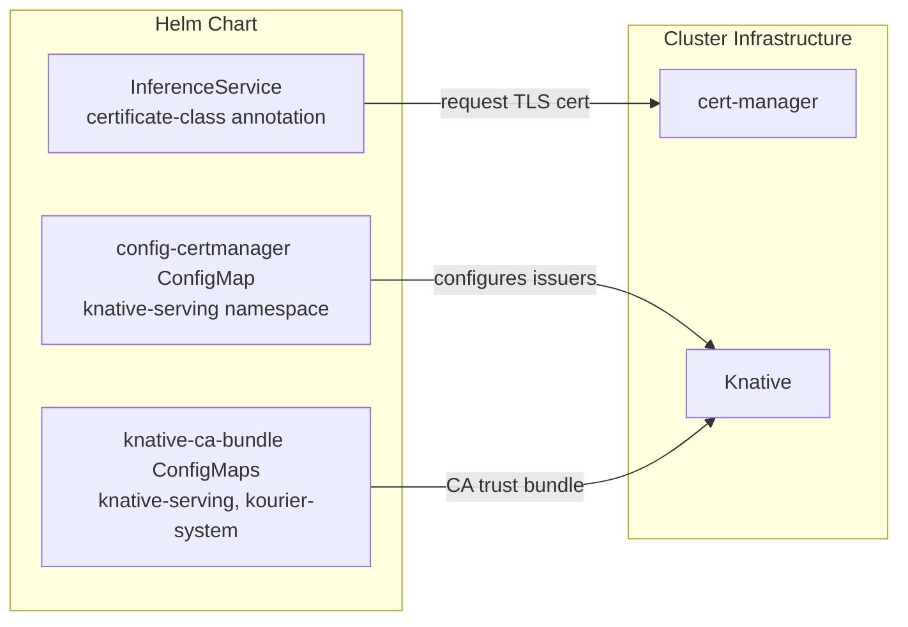

# Architecture

This document explains how the system is built, how components interact, and how a request travels from your client to the model and back.

---

## High-Level Overview

The system is a **layered architecture** on Kubernetes. Each layer handles a different concern:

1. **Gateway Layer** (Kourier) — Knative internal routing
2. **Orchestration Layer** (KServe) — Manages model lifecycle
3. **Serverless Layer** (Knative) — Autoscaling and revisions
4. **Inference Layer** (vLLM) — Runs the actual model


```mermaid
flowchart TB
    subgraph Client["Client"]
        C["curl / app / OpenAI SDK"]
    end

    subgraph Gateway["Gateway Layer"]
        K["Kourier<br/>(Envoy proxy)<br/>Revision routing"]
    end

    subgraph Pod["Predictor Pod"]
        QP["queue-proxy<br/>Knative sidecar<br/>Port 8013"]
        V["kserve-container<br/>vLLM engine<br/>Port 8080<br/>/health, /v1/chat/..."]
    end

    subgraph Model["Model"]
        M["LLM Model<br/>HuggingFace"]
    end

    C --> K
    K -->|"Host → revision"| QP
    QP -->|"concurrency limit, metrics"| V
    V --> M
```

---

## Request Flow (Step by Step)


```mermaid
sequenceDiagram
    participant Client
    participant Kourier
    participant QueueProxy as queue-proxy
    participant vLLM
    participant Model

    Client->>Kourier: POST /v1/chat/completions<br/>Host: <model>-predictor.<namespace>.llm.local
    Kourier->>QueueProxy: route to correct revision
    QueueProxy->>vLLM: forward on :8080
    vLLM->>Model: run inference
    Model-->>vLLM: generated tokens
    vLLM-->>QueueProxy: JSON response
    QueueProxy-->>Kourier: response
    Kourier-->>Client: response
```

### Step 1: Kourier routes to the right revision

Kourier is Knative's networking gateway (built on Envoy). It maintains a routing table mapping hostnames to the current active **revision** of each Knative service.

Knative creates a new revision every time the InferenceService configuration changes (e.g., model version, resource limits). Kourier ensures traffic always reaches the correct revision.

### Step 2: queue-proxy receives the request

Each predictor pod has a **queue-proxy** sidecar (injected by Knative). It:

- Limits concurrent requests (default: 100)
- Reports metrics to the Knative autoscaler
- Aggregates health checks from the kserve-container
- Buffers requests during scaling events

### Step 3: vLLM processes the request

The **kserve-container** runs the vLLM inference engine:

1. **Tokenizes** input text (words → numbers)
2. **Runs inference** on the transformer model
3. **Decodes** output (numbers → words)
4. Returns an OpenAI-compatible JSON response

### Step 4: Response flows back

The response travels the reverse path: vLLM → queue-proxy → Kourier → Client.

---

## Autoscaling


```mermaid
flowchart LR
    subgraph Metrics["Knative Autoscaler"]
        A["Autoscaler<br/>watches concurrency"]
    end

    subgraph Pods["Predictor Pods"]
        P1["Pod 1<br/>1 req"]
        P2["Pod 2<br/>1 req"]
        P3["Pod 3<br/>(idle)"]
    end

    A -->|"target: 1 req/pod"| Pods
    A -->|"scale up"| New["Pod N+1"]
    A -->|"scale down"| Remove["remove idle pods"]
```

Configured via annotations on the InferenceService:

```yaml
annotations:
  autoscaling.knative.dev/minScale: "1"
  autoscaling.knative.dev/maxScale: "3"
  autoscaling.knative.dev/target: "1"
```

---

## Model Deployment

Each model is defined as an **InferenceService** which references a **ServingRuntime**:


```mermaid
flowchart TB
    subgraph KServe["InferenceService<br/>vllm-phi2"]
        direction TB
        IS["serving.kserve.io/v1beta1"] --> KSvc["Knative Service"]
        KSvc --> Rev["Revision"]
        Rev --> Dep["Deployment"]
        Dep --> Pod1["Pod"]
    end

    subgraph Pod1["Predictor Pod"]
        QP["queue-proxy<br/>:8013"]
        VC["kserve-container<br/>vLLM<br/>:8080"]
    end
```

Key details:
- **ServingRuntime** defines the vLLM container image, args, probes, and resource defaults
- **InferenceService** references the runtime and provides model-specific config (model ID, autoscaling, observability)
- **port named `http1`** — Forces HTTP/1.1 (Knative defaults to HTTP/2)
- **Shared PVC** — Models share `model-cache` to avoid re-downloading weights
- **Custom chat template** — Provided via ConfigMap for models that need one
- **Probes** — Startup, readiness, and liveness probes ensure the pod only receives traffic when healthy

---

## Cert-Manager Integration

The chart optionally integrates with cert-manager to manage Knative TLS certificates:


```mermaid
flowchart LR
    subgraph Chart["Helm Chart"]
        CC["config-certmanager ConfigMap<br/>knative-serving namespace"]
        TB["knative-ca-bundle ConfigMaps<br/>knative-serving, kourier-system"]
        IS["InferenceService<br/>certificate-class annotation"]
    end

    subgraph Infra["Cluster Infrastructure"]
        CM["cert-manager"]
        KN["Knative"]
    end

    CC -->|"configures issuers"| KN
    TB -->|"CA trust bundle"| KN
    IS -->|"request TLS cert"| CM
```

- Configured via `certManager` block in values.yaml
- Creates the `config-certmanager` ConfigMap in `knative-serving` namespace with issuer references
- Distributes CA trust bundles via `knative-ca-bundle` ConfigMaps
- Injects `networking.knative.dev/certificate-class` annotation on each InferenceService

---

## Observability

Per-model observability is configured in the `inferenceServices` section:

| Feature | Method | Annotation |
|---|---|---|
| Prometheus scraping | InferenceService annotations | `prometheus.io/scrape: "true"` |
| OTel sidecar | `sidecar.opentelemetry.io/inject` | Annotation injection |
| Metric aggregation | KServe metric aggregation | `serving.kserve.io/enable-metric-aggregation` |
| Autoscaling backend | KServe autoscalerClass | `serving.kserve.io/autoscalerClass` |

---

## Resources Deployed

The Helm chart creates resources from multiple sources:

### bjw-s app-template (native features)

| # | Kind | Name | Purpose |
|---|---|---|---|
| 1 | `ConfigMap` | `phi2-chat-template` | Phi-2 chat template (Jinja2) |
| 2 | `PersistentVolumeClaim` | `model-cache` | Model weight cache |
| 3 | `ClusterRole` | `test-model-deployment` | cert-manager RBAC |
| 4 | `ClusterRoleBinding` | `test-model-deployment` | Binds ClusterRole to SA |
| 5 | `NetworkPolicy` | `model-deployment` | Security rules (if enabled) |
| 6 | `PriorityClass` | (multiple) | Workload scheduling (if enabled) |

### bjw-s app-template (rawResources)

| # | Kind | Name | Purpose |
|---|---|---|---|
| 7 | `PodDisruptionBudget` | `model-deployment-model-pdb` | HA (if enabled) |
| 8 | `PrometheusRule` | `model-deployment-prometheus-alerts` | Alerting (if enabled) |

### Custom templates

| # | Kind | Name | Purpose |
|---|---|---|---|
| 9 | `ConfigMap` | `config-certmanager` in `knative-serving` | Knative cert-manager config |
| 10 | `ConfigMap` | `knative-ca-bundle` (multiple ns) | CA trust distribution |
| 11 | `ClusterIssuer` | (self-signed/CA) | Bootstrap issuers (optional) |
| 12 | `ServingRuntime` | `vllm-cpu` | vLLM runtime definition |
| 13 | `InferenceService` | `vllm-phi2` | Model deployment |

---

## Security

| Resource | Purpose |
|---|---|
| NetworkPolicy (optional) | Restrict inbound/outbound traffic |
| cert-manager integration | TLS certificates for Knative routes |
| PodDisruptionBudget (optional) | Ensure HA during disruptions |
| PriorityClasses (optional) | Schedule critical workloads first |
| Resource quotas | Optional namespace resource caps |

---

## Next Steps

- [Learn about each technology](technologies.md) in detail
- [Deploy the system](deployment.md) step by step
- [Explore configuration options](configuration.md)
- [Integrate with AI-Ops (Envoy AI Gateway)](ai-ops-integration.md)
