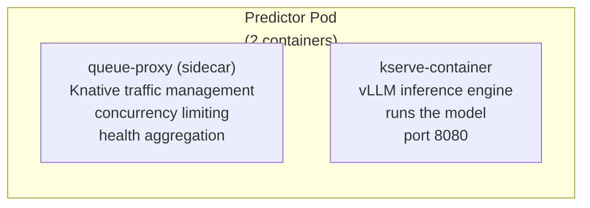
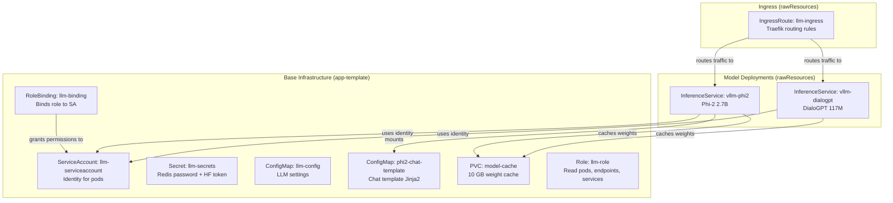
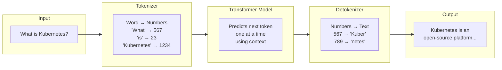
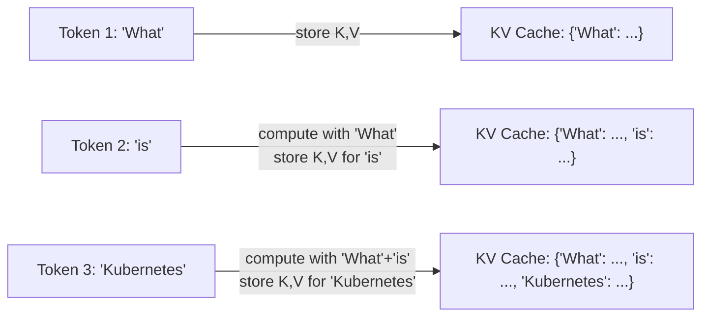
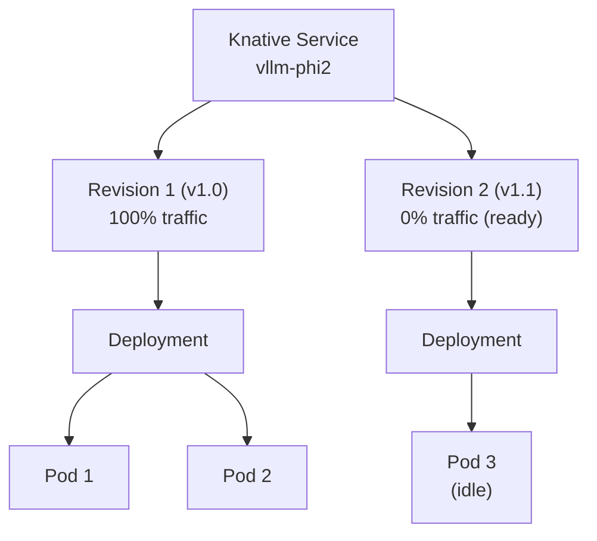
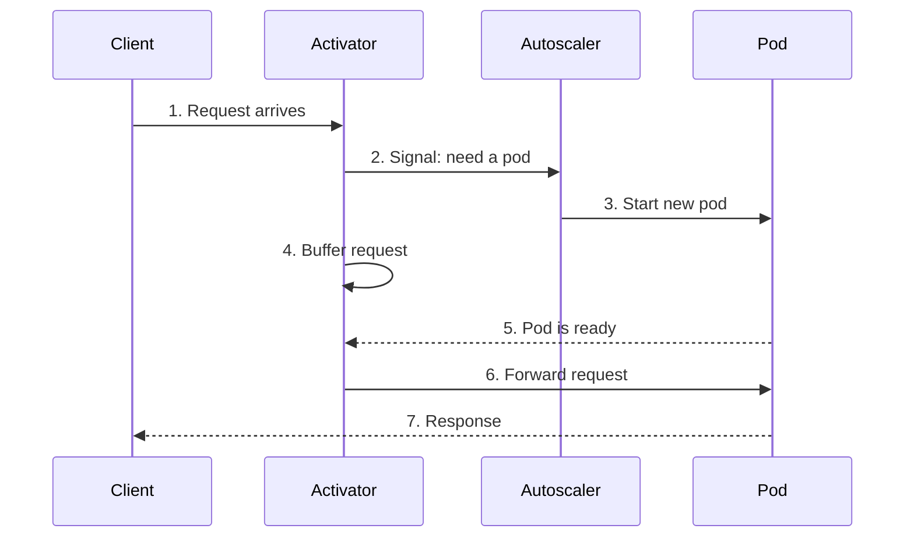
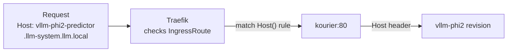
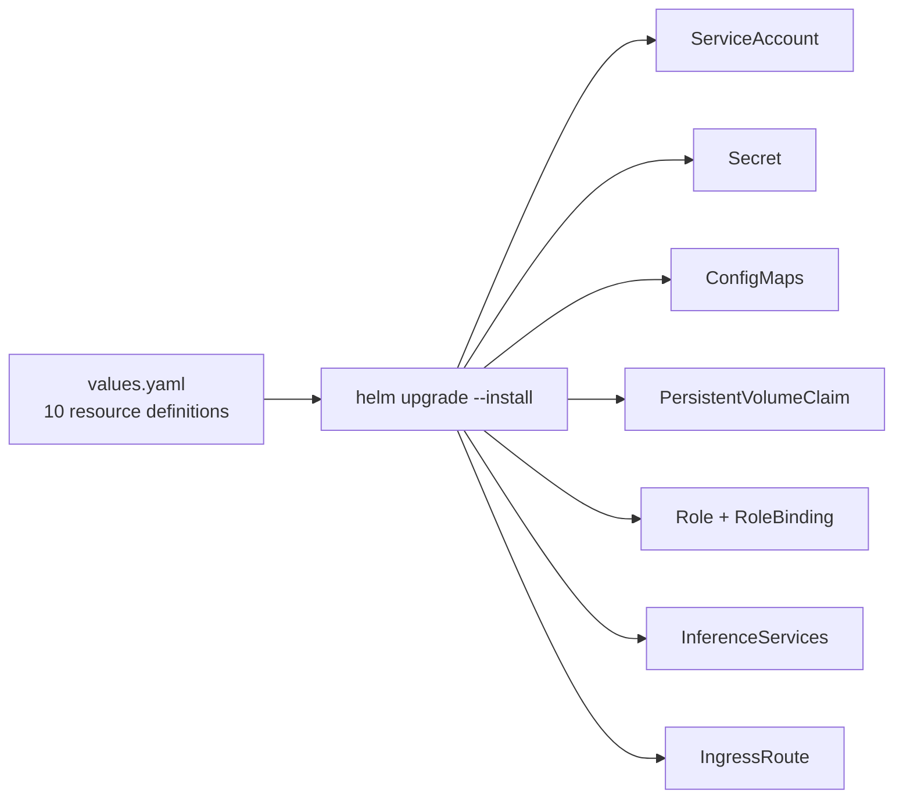

# Concepts

This page explains the key concepts you need to understand to work with this project. Each section is written for entry-level engineers.

---

## Kubernetes Concepts

### Pod

A **pod** is the smallest unit in Kubernetes. It is a group of one or more containers that share the same network and storage. In this project, each model runs in its own pod.



Each pod has **2/2 containers ready**. The `kserve-container` runs the model, and the `queue-proxy` handles networking and scaling.

### Deployment

A **deployment** tells Kubernetes how many pods to run and how to update them. In our system, you will see deployments like:

```
deployment.apps/vllm-phi2-predictor-00001-deployment
```

This is auto-generated by Knative. You should not modify it directly. Instead, update the InferenceService, and Knative will create a new revision (which creates a new deployment).

### Namespace

A **namespace** groups related resources together. All our model resources live in the `llm-system` namespace.

```bash
kubectl get all -n llm-system
```

> Think of a namespace like a folder on your computer — it keeps things organized.

### Service

A **service** is a stable network endpoint that points to one or more pods. Pods can come and go (restart, scale up/down), but the service name stays the same. In our system:

- **Kourier service** in `kourier-system` namespace receives all traffic
- It routes to the correct **Knative service** based on the hostname
- The Knative service routes to the current **revision** (which has its own service)

### ConfigMap

A **ConfigMap** stores configuration data as key-value pairs. We use ConfigMaps for:
- `llm-config` — General LLM configuration
- `phi2-chat-template` — Jinja2 chat template for Phi-2

ConfigMaps can be mounted as files or injected as environment variables.

### Secret

A **Secret** is like a ConfigMap but for sensitive data (passwords, tokens). We use a Secret for:
- Redis password
- HuggingFace authentication token (if needed)

### PersistentVolumeClaim (PVC)

A **PVC** is a request for storage. Our `model-cache` PVC requests 10 GB to store downloaded HuggingFace model weights.

### Role / RoleBinding

- **Role** — Defines what permissions are allowed (e.g., "can read pods")
- **RoleBinding** — Assigns the Role to a user or service account

Our `llm-role` allows the model pods to read endpoints, pods, and services.

### ServiceAccount

A **ServiceAccount** is an identity for a pod. Our pods use `llm-serviceaccount` to authenticate to the Kubernetes API.

### How all 10 resources fit together



---

## LLM Serving Concepts

### What is an LLM?

A **Large Language Model** (LLM) is a type of AI model that understands and generates human-like text. Examples include GPT, LLaMA, and Phi-2.

### How text generation works



The model generates one token at a time, using the previously generated tokens as context for the next prediction.

### What is vLLM?

**vLLM** is an inference engine that runs LLMs efficiently. It uses **PagedAttention** to manage memory better.

> Without vLLM: The KV cache is stored in one big contiguous block. Memory gets fragmented and wasted.
>
> With vLLM: The KV cache is split into small blocks (pages). Memory is used efficiently.

### What is PagedAttention?

PagedAttention is inspired by virtual memory in operating systems:

- **Traditional approach**: Allocate one big block for the entire KV cache (wasteful)
- **PagedAttention**: Allocate small fixed-size blocks (pages) and link them together

This allows:
- Near-zero memory waste
- Larger batch sizes (more concurrent users)
- 2-4x higher throughput

### What is the KV Cache?

During text generation, the model computes attention scores between every pair of tokens. To avoid recomputing these scores for tokens that have already been processed, the model stores them in a **KV (Key-Value) cache**.



The KV cache grows with the sequence length. This is why `max-model-len` matters — it limits how big the cache can get.

---

## KServe Concepts

### What is KServe?

**KServe** is a Kubernetes tool that makes it easy to deploy and manage ML models. It introduces a new resource called the **InferenceService**.

### What is an InferenceService?

An **InferenceService** is a single YAML file that defines everything needed to serve a model:

```yaml
apiVersion: serving.kserve.io/v1beta1
kind: InferenceService
metadata:
  name: vllm-phi2
spec:
  predictor:
    containers:
      - name: kserve-container
        image: substratusai/vllm:main-cpu
        args: [ "--model", "microsoft/phi-2" ]
```

When you create this, KServe automatically:
1. Creates a Knative Service (which creates a Deployment, Service, etc.)
2. Sets up health checks
3. Configures autoscaling
4. Manages rolling updates

> Without KServe, you would need to create 5-10 different Kubernetes resources manually.

---

## Knative Concepts

### What is Knative?

**Knative** (pronounced "nay-tiv") is a serverless platform for Kubernetes. It provides:

- **Autoscaling** — Scale pods up/down based on request volume
- **Revisions** — Track configuration changes for rollbacks
- **Traffic splitting** — Send a percentage of traffic to different versions

### Service vs Revision



- A **Revision** is an immutable snapshot of the configuration
- Every time you update the InferenceService, a new Revision is created
- Old Revisions remain available for rollback

### What is the Activator?



In our system, `minScale: 1` means we always have one pod running, so the activator is rarely used. This avoids the cold-start delay.

---

## Ingress Concepts

### What is an Ingress?

An **ingress** controls external access to services inside a Kubernetes cluster. It is like a receptionist that routes visitors to the right office.

### Traefik IngressRoute



Our IngressRoute in `values.yaml`:

```yaml
- match: Host(`vllm-phi2-predictor.llm-system.llm.local`)
  services:
    - name: kourier
      namespace: kourier-system
      port: 80
```

This means:
- If the `Host` header is `vllm-phi2-predictor.llm-system.llm.local`
- Forward to the `kourier` service on port 80 in the `kourier-system` namespace

### Why a custom Host header?

The Traefik IngressRoute uses **host-based routing**. All models are on the same port (80), but they are distinguished by the `Host` header. This is why every curl command includes `-H "Host: vllm-phi2-predictor.llm-system.llm.local"`.

---

## Helm Concepts

### What is Helm?

**Helm** is a package manager for Kubernetes. A Helm **chart** is a collection of YAML templates that can be installed with one command.

### Chart vs Release

- **Chart** — The template package (in `charts/model-deployment/`)
- **Release** — A specific installation of a chart (e.g., `model-deployment` in namespace `llm-system`)

### What is bjw-s/app-template?

The `bjw-s/app-template` is a community Helm chart that provides a convenient way to define Kubernetes applications. Instead of writing separate templates for every resource, you define everything in `values.yaml`.



---

## Makefile Concepts

The `Makefile` at the project root provides shortcuts for common tasks.

| Target | What it does |
|---|---|
| `make deploy` | Deploy everything via kubectl |
| `make helm-deploy` | Deploy everything via Helm |
| `make test` | Test both models |
| `make clean` | Remove models and ingress |
| `make status` | Show deployment status |

---

## Related

- [Glossary](glossary.md) — Terms and definitions
- [Technologies](technologies.md) — Deep dive into each technology
- [Getting Started](getting-started.md) — First deployment
