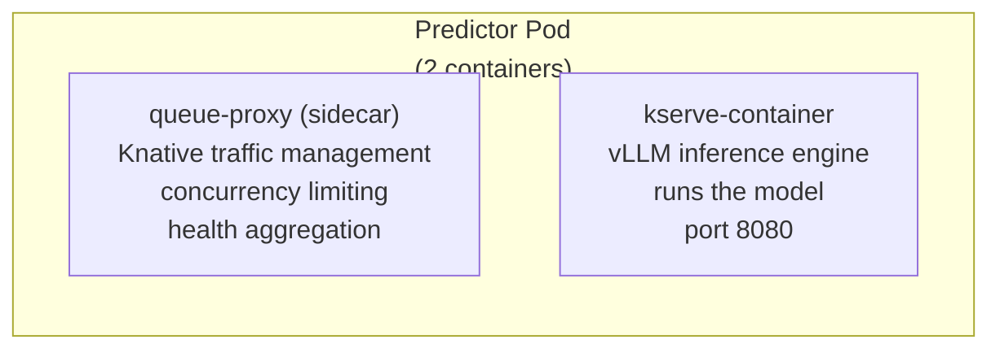
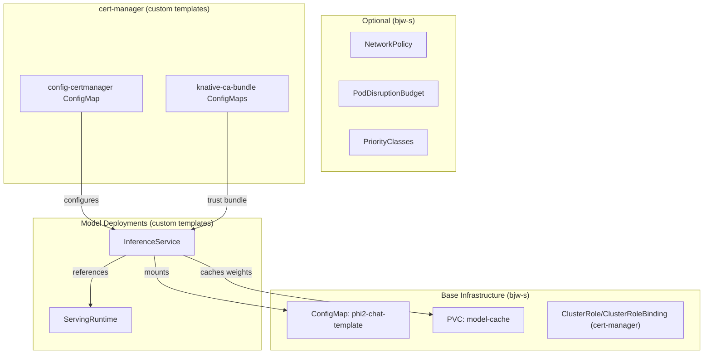
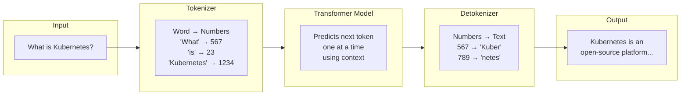
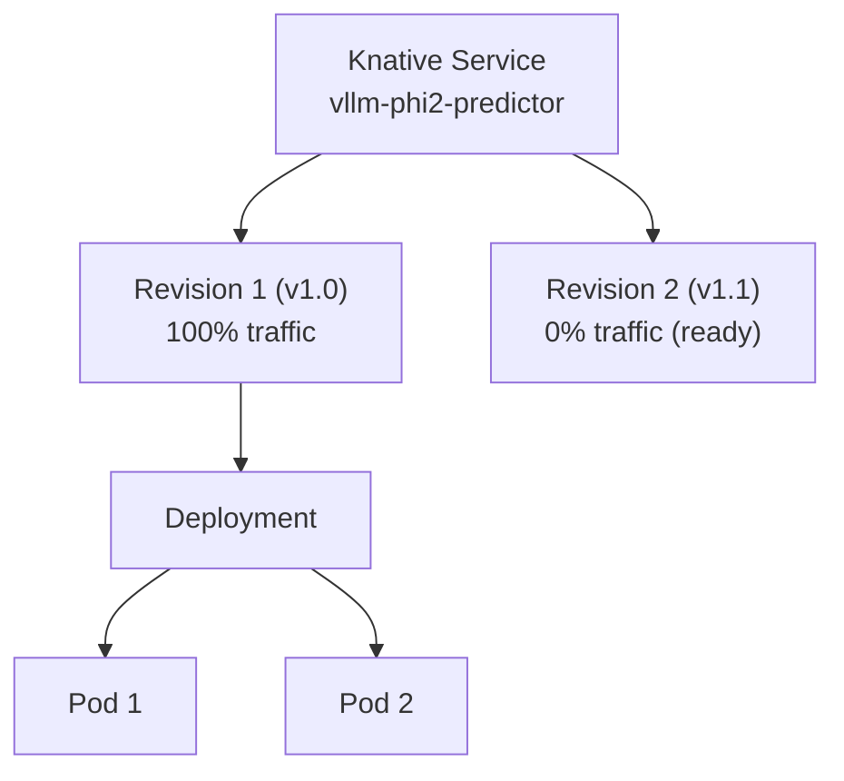
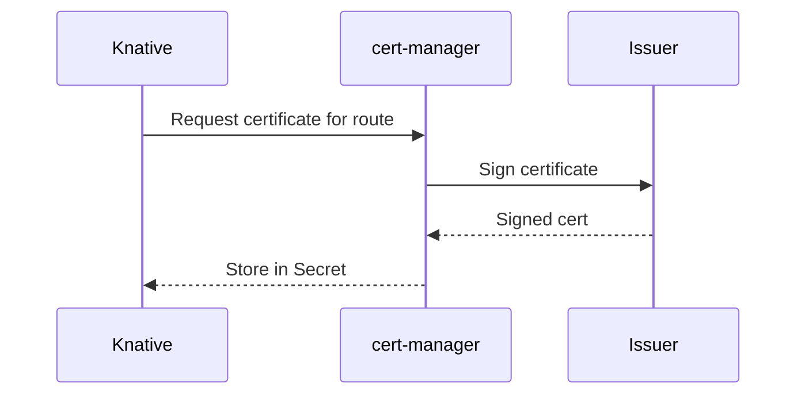

# Concepts

This page explains the key concepts you need to understand to work with this project.

---

## Kubernetes Concepts

### Pod

A **pod** is the smallest unit in Kubernetes. It is a group of one or more containers that share the same network and storage.


```mermaid
flowchart TB
    subgraph Pod["Predictor Pod<br/>(2 containers)"]
        direction TB
        QP["queue-proxy (sidecar)<br/>Knative traffic management<br/>concurrency limiting<br/>health aggregation"]
        VC["kserve-container<br/>vLLM inference engine<br/>runs the model<br/>port 8080"]
    end
```

Each pod has **2/2 containers ready**. The `kserve-container` runs the model, and the `queue-proxy` handles networking and scaling.

### Deployment

A **deployment** tells Kubernetes how many pods to run. In our system, deployments are auto-generated by Knative:

```
deployment.apps/vllm-phi2-predictor-00001-deployment
```

Do not modify these directly. Update the `InferenceService` instead, and Knative will create a new revision.

### Namespace

A **namespace** groups related resources together. All our model resources live in the `llm-system` namespace.

```bash
kubectl get all -n llm-system
```

### Service

A **service** is a stable network endpoint that points to one or more pods.

- **Kourier service** in `kourier-system` receives all traffic
- It routes to the correct **Knative service** based on the hostname
- The Knative service routes to the current **revision**

### ConfigMap

A **ConfigMap** stores configuration data. We use one for:
- `phi2-chat-template` — Jinja2 chat template for models that need one

### PersistentVolumeClaim (PVC)

A **PVC** is a request for storage. Our `model-cache` PVC stores downloaded HuggingFace model weights.

### ServiceAccount

A **ServiceAccount** is an identity for a pod. Pods use the `default` ServiceAccount in the namespace.

### Role / RoleBinding

- **Role/ClusterRole** — Defines what permissions are allowed
- **RoleBinding/ClusterRoleBinding** — Assigns the Role to a user or service account

The chart creates a ClusterRole for cert-manager API access.

### How resources fit together


```mermaid
flowchart TB
    subgraph Base["Base Infrastructure (bjw-s)"]
        CM["ConfigMap: phi2-chat-template"]
        PVC["PVC: model-cache"]
        RBAC["ClusterRole/ClusterRoleBinding (cert-manager)"]
    end

    subgraph Optional["Optional (bjw-s)"]
        NP["NetworkPolicy"]
        PDB["PodDisruptionBudget"]
        PC["PriorityClasses"]
    end

    subgraph Cert["cert-manager (custom templates)"]
        CC["config-certmanager ConfigMap"]
        TB["knative-ca-bundle ConfigMaps"]
    end

    subgraph Models["Model Deployments (custom templates)"]
        SR["ServingRuntime"]
        IS["InferenceService"]
    end

    IS -->|"references"| SR
    IS -->|"mounts"| CM
    IS -->|"caches weights"| PVC
    CC -->|"configures"| IS
    TB -->|"trust bundle"| IS
```

---

## LLM Serving Concepts

### What is an LLM?

A **Large Language Model** (LLM) is a type of AI model that understands and generates human-like text.

### How text generation works


```mermaid
flowchart LR
    subgraph Input["Input"]
        TEXT["What is Kubernetes?"]
    end

    subgraph Tokenizer["Tokenizer"]
        T1["Word → Numbers<br/>'What' → 567<br/>'is' → 23<br/>'Kubernetes' → 1234"]
    end

    subgraph Model["Transformer Model"]
        PRED["Predicts next token<br/>one at a time<br/>using context"]
    end

    subgraph Detokenizer["Detokenizer"]
        DT["Numbers → Text<br/>567 → 'Kuber'<br/>789 → 'netes'"]
    end

    subgraph Output["Output"]
        OUT["Kubernetes is an<br/>open-source platform..."]
    end

    TEXT --> Tokenizer
    Tokenizer --> Model
    Model --> Detokenizer
    Detokenizer --> OUT
```

The model generates one token at a time, using previously generated tokens as context.

### What is vLLM?

**vLLM** is an inference engine that runs LLMs efficiently using **PagedAttention** to manage memory better.

### What is PagedAttention?

PagedAttention is inspired by virtual memory in operating systems:
- **Traditional**: Allocate one big block for KV cache (wasteful)
- **PagedAttention**: Allocate small fixed-size blocks (pages) linked together

This allows near-zero memory waste, larger batch sizes, and 2-4x higher throughput.

---

## KServe Concepts

### What is KServe?

**KServe** is a Kubernetes tool for deploying ML models. It introduces two key resources:

- **ServingRuntime** — Defines the runtime container configuration
- **InferenceService** — Defines a model deployment

```yaml
apiVersion: serving.kserve.io/v1beta1
kind: InferenceService
metadata:
  name: vllm-phi2
spec:
  predictor:
    model:
      modelFormat:
        name: huggingface
      runtime: vllm-cpu
      storageUri: hf://microsoft/phi-2
```

When created, KServe automatically creates a Knative Service, sets up health checks, and configures autoscaling.

---

## Knative Concepts

### What is Knative?

**Knative** (pronounced "nay-tiv") is a serverless platform for Kubernetes providing:

- **Autoscaling** — Scale pods up/down based on request volume
- **Revisions** — Track configuration changes for rollbacks
- **Traffic splitting** — Canary deployments

### Service vs Revision


```mermaid
flowchart TB
    KSvc["Knative Service<br/>vllm-phi2-predictor"]
    KSvc --> Rev1["Revision 1 (v1.0)<br/>100% traffic"]
    KSvc --> Rev2["Revision 2 (v1.1)<br/>0% traffic (ready)"]

    Rev1 --> Dep1["Deployment"]
    Dep1 --> P1["Pod 1"]
    Dep1 --> P2["Pod 2"]
```

- A **Revision** is an immutable snapshot of the configuration
- Every update creates a new Revision
- Old Revisions remain available for rollback

---

## Cert-Manager Concepts

### What is cert-manager?

**cert-manager** automates TLS certificate management in Kubernetes. The chart uses it to:

1. Configure Knative to request certificates for Knative Service routes
2. Distribute a CA trust bundle so internal services trust the TLS certificates
3. Optionally bootstrap a local CA for self-signed internal TLS


```mermaid
sequenceDiagram
    participant Knative
    participant cert-manager
    participant Issuer

    Knative->>cert-manager: Request certificate for route
    cert-manager->>Issuer: Sign certificate
    Issuer-->>cert-manager: Signed cert
    cert-manager-->>Knative: Store in Secret
```

---

## Helm Concepts

### What is Helm?

**Helm** is a package manager for Kubernetes. A Helm **chart** is a collection of YAML templates that can be installed with one command.

### Chart vs Release

- **Chart** — The template package
- **Release** — A specific installation of a chart

### How this chart works

The chart uses **bjw-s/app-template** as a subchart for standard resources (ConfigMaps, PVC, RBAC) and **custom templates** for KServe CRDs and cert-manager integration.

---

## Related

- [Glossary](glossary.md) — Terms and definitions
- [Technologies](technologies.md) — Deep dive into each technology
- [Getting Started](getting-started.md) — First deployment
