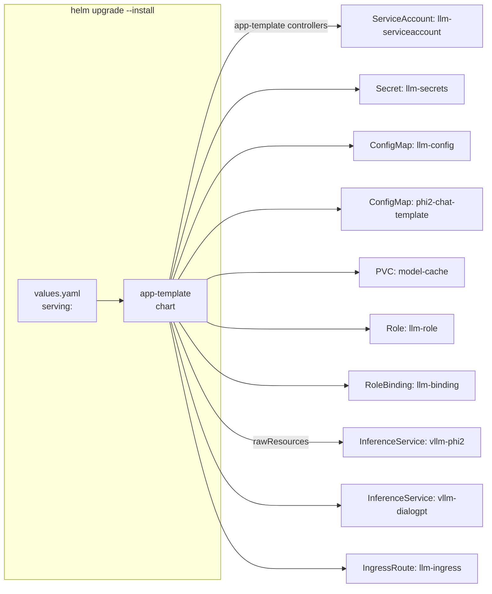

# Deployment

This page covers both ways to deploy the system: **Helm** (recommended) and **kubectl** (direct). Each section includes the exact commands and explains what they do.

---

## Prerequisites

Before deploying, you need a Kubernetes cluster with the following installed:

| Component | Installation Command |
|---|---|
| KServe | `kubectl apply -f https://github.com/kserve/kserve/releases/download/v0.14.0/kserve.yaml` |
| Knative Serving | `kubectl apply -f https://github.com/knative/serving/releases/download/knative-v1.16.0/serving-crds.yaml` and `-f serving-core.yaml` |
| Kourier | `kubectl apply -f https://github.com/knative/net-kourier/releases/download/knative-v1.16.0/kourier.yaml` |
| Knative to Kourier | `kubectl patch configmap/config-network -n knative-serving --type merge -p '{"data":{"ingress-class":"kourier.ingress.networking.knative.dev"}}'` |

---

## Method 1: Helm (Recommended)

Helm packages all Kubernetes resources into a single chart. This project uses the `bjw-s/app-template` chart as a dependency.



### Option A: From the published chart repository

```bash
# Add the repo (one-time)
helm repo add local-model-deployment https://dericko681.github.io/local-model-deployment
helm repo update

# Deploy
helm upgrade --install model-deployment local-model-deployment/model-deployment \
  --namespace llm-system \
  --create-namespace \
  --skip-schema-validation
```

### Option B: From source

```bash
# 1. Update Dependencies
helm dependency update charts/model-deployment

# 2. Preview (Optional)
helm template model-deployment charts/model-deployment \
  --namespace llm-system \
  --skip-schema-validation

# 3. Deploy
helm upgrade --install model-deployment charts/model-deployment \
  --namespace llm-system \
  --create-namespace \
  --skip-schema-validation
```

| Flag | Meaning |
|---|---|
| `--install` | Install if not present, upgrade if it is |
| `--namespace llm-system` | Deploy into the `llm-system` namespace |
| `--create-namespace` | Create the namespace if it does not exist |
| `--skip-schema-validation` | Skip schema validation for CRDs |

### 4. Configure Knative Domain

```bash
kubectl patch configmap config-domain \
  -n knative-serving \
  --type merge \
  -p '{"data":{"llm.local":""}}'
```

Tells Knative to use `llm.local` as the domain suffix for all Knative services.

### What the Helm chart creates

| # | Kind | Name | values.yaml source |
|---|---|---|---|
| 1 | `ServiceAccount` | `llm-serviceaccount` | `servicing.serviceAccount.main` |
| 2 | `Secret` | `llm-secrets` | `servicing.secrets.llm-secrets` |
| 3 | `ConfigMap` | `llm-config` | `servicing.configMaps.llm-config` |
| 4 | `ConfigMap` | `phi2-chat-template` | `servicing.configMaps.phi2-chat-template` |
| 5 | `PersistentVolumeClaim` | `model-cache` | `servicing.persistence.model-cache` |
| 6 | `Role` | `llm-role` | `servicing.rbac.roles.llm-role` |
| 7 | `RoleBinding` | `llm-binding` | `servicing.rbac.bindings.llm-binding` |
| 8 | `InferenceService` | `vllm-phi2` | `servicing.rawResources.phi2` |
| 9 | `InferenceService` | `vllm-dialogpt` | `servicing.rawResources.dialogpt` |
| 10 | `IngressRoute` | `llm-ingress` | `servicing.rawResources.traefik-ingress` |

See [Architecture → Resources](architecture.md#resources-deployed) for a detailed explanation of each.

---

## Method 2: kubectl

The `k8s/` directory contains standalone YAML files. Apply them in dependency order.

### Using Make

```bash
# Deploy everything
make deploy

# Deploy only DialoGPT
make deploy-kserve

# Deploy only Phi-2
make deploy-phi2
```

`make deploy`:
1. Creates the namespace
2. Applies ConfigMaps, Secrets, RBAC, and storage
3. Configures the Knative domain
4. Applies both InferenceServices and the Traefik IngressRoute

### Manual

```bash
# 1. Namespace
kubectl apply -f k8s/namespaces/namespace.yaml

# 2. Base infrastructure
kubectl apply -f k8s/configmaps/configmaps.yaml
kubectl apply -f k8s/configmaps/phi2-chat-template.yaml
kubectl apply -f k8s/secrets/secrets.yaml
kubectl apply -f k8s/rbac/rbac.yaml
kubectl apply -f k8s/storage/storage.yaml

# 3. Knative domain
kubectl patch configmap config-domain -n knative-serving \
  --type merge -p '{"data":{"llm.local":""}}'

# 4. Models
kubectl apply -f k8s/kserve/vllm-inference-service.yaml
kubectl apply -f k8s/kserve/vllm-phi2-inference-service.yaml

# 5. Ingress
kubectl apply -f k8s/ingress/traefik-ingress.yaml
```

---

## Verifying the Deployment

```bash
# Check all resources
kubectl get inferenceservice,ksvc,deployment,pod,ingressroute -n llm-system

# Watch pods start up
kubectl get pods -n llm-system -w
```

Expected output (after pods are ready):

```
NAME                                   READY   STATUS    RESTARTS   AGE
vllm-phi2-predictor-00001-deployment-xxx   2/2   Running   0          2m
vllm-dialogpt-predictor-00001-deployment-xxx  2/2 Running  0          2m
```

Each pod has **2/2 containers ready**: the `queue-proxy` (Knative sidecar) and `kserve-container` (vLLM engine).

---

## Testing

```bash
# Using Make
make test
```

Or manually:

```bash
# Phi-2 chat completion
curl -s \
  -H "Host: vllm-phi2-predictor.llm-system.llm.local" \
  -H "Content-Type: application/json" \
  -d '{"model": "microsoft/phi-2", "messages": [{"role": "user", "content": "Hello"}], "max_tokens": 50}' \
  http://192.168.4.35/v1/chat/completions | python3 -m json.tool

# DialoGPT chat completion
curl -s \
  -H "Host: vllm-dialogpt-predictor.llm-system.llm.local" \
  -H "Content-Type: application/json" \
  -d '{"model": "microsoft/DialoGPT-small", "messages": [{"role": "user", "content": "Hello"}], "max_tokens": 50}' \
  http://192.168.4.35/v1/chat/completions | python3 -m json.tool
```

---

## Cleanup

### Helm

```bash
helm uninstall model-deployment --namespace llm-system
```

### kubectl

```bash
# Remove only models and ingress
make clean

# Remove everything including storage, secrets, configmaps, RBAC
make clean-all
```

---

## Troubleshooting

### Pods stuck in ContainerCreating

```bash
kubectl describe pod <pod-name> -n llm-system
```

Common causes:
- PVC `model-cache` not bound (check `kubectl get pvc -n llm-system`)
- Insufficient CPU/memory on the node

### InferenceService not becoming ready

```bash
kubectl get inferenceservice -n llm-system -o yaml
kubectl get revisions -n llm-system
kubectl get ksvc -n llm-system
```

Check for error messages in the status conditions.

### Model returns errors

```bash
# Check vLLM logs
kubectl logs -n llm-system -l serving.knative.dev/service=vllm-phi2-predictor \
  -c kserve-container --tail=100
```

---

## Related

- [Getting Started](getting-started.md) — First deployment guide
- [Architecture](architecture.md) — How the system works
- [API Reference](api-reference.md) — Endpoints and testing
- [Configuration](configuration.md) — Customization options
