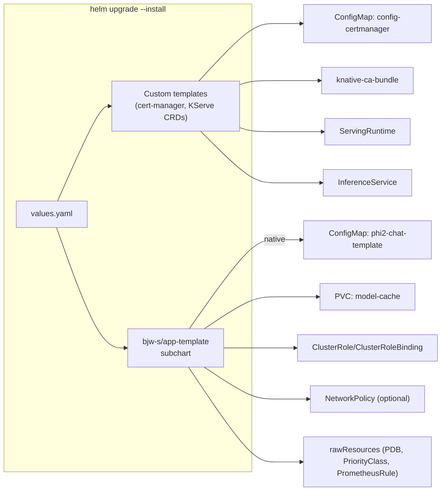

# Deployment

This page covers Helm-based deployment (recommended).

---

## Prerequisites

Before deploying, you need a Kubernetes cluster with the following installed:

| Component | Instructions |
|---|---|
| KServe | `kubectl apply --server-side --force-conflicts -f https://github.com/kserve/kserve/releases/download/v0.18.0/kserve.yaml` |
| Knative Serving | `kubectl apply -f https://github.com/knative/serving/releases/download/knative-v1.21.2/serving-crds.yaml` and `serving-core.yaml` |
| Kourier | `kubectl apply -f https://github.com/knative-extensions/net-kourier/releases/download/knative-v1.21.0/kourier.yaml` |
| cert-manager | `kubectl apply -f https://github.com/cert-manager/cert-manager/releases/download/v1.16.0/cert-manager.yaml` |
| Knative config | `kubectl patch configmap/config-network -n knative-serving --type merge -p '{"data":{"ingress-class":"kourier.ingress.networking.knative.dev"}}'` |
| Knative domain | `kubectl patch configmap config-domain -n knative-serving --type merge -p '{"data":{"llm.local":""}}'` |
| PVC support | `kubectl patch configmap config-features -n knative-serving --type merge -p '{"data":{"kubernetes.podspec-persistent-volume-claim":"enabled","kubernetes.podspec-persistent-volume-write":"enabled"}}'` |

### Optional: Prometheus Operator CRDs

For ServiceMonitor and PrometheusRule features:

```bash
kubectl apply -f https://github.com/prometheus-operator/prometheus-operator/releases/latest/download/bundle.yaml
```

---

## Method 1: Helm Install from Source


```mermaid
flowchart LR
    subgraph Helm["helm upgrade --install"]
        VALS["values.yaml"]
        TEMPLATES["Custom templates<br/>(cert-manager, KServe CRDs)"]
        BJWS["bjw-s/app-template<br/>subchart"]
    end

    VALS --> TEMPLATES
    VALS --> BJWS

    BJWS -->|"native"| CM["ConfigMap: phi2-chat-template"]
    BJWS --> PVC["PVC: model-cache"]
    BJWS --> RBAC["ClusterRole/ClusterRoleBinding"]
    BJWS --> NP["NetworkPolicy (optional)"]
    BJWS --> RAW["rawResources (PDB, PriorityClass, PrometheusRule)"]

    TEMPLATES --> CC["ConfigMap: config-certmanager"]
    TEMPLATES --> TB["knative-ca-bundle"]
    TEMPLATES --> SR["ServingRuntime"]
    TEMPLATES --> IS["InferenceService"]
```

### 1. Update Dependencies

```bash
helm dependency update charts/model-deployment
```

### 2. Preview (Optional)

```bash
helm template model-deployment charts/model-deployment --namespace llm-system
```

### 3. Deploy

```bash
helm upgrade --install model-deployment charts/model-deployment \
  --namespace llm-system --create-namespace
```

### 4. With All Optional Features

```bash
helm upgrade --install model-deployment charts/model-deployment \
  --namespace llm-system --create-namespace \
  --set serving.networkpolicies.main.enabled=true \
  --set serving.serviceMonitor.main.enabled=true \
  --set 'serving.rawResources.prometheus-alerts.enabled=true' \
  --set 'serving.rawResources.model-pdb.enabled=true' \
  --set 'serving.rawResources.high-priority.enabled=true' \
  --set 'serving.rawResources.medium-priority.enabled=true' \
  --set 'serving.rawResources.low-priority.enabled=true'
```

| Flag | Meaning |
|---|---|
| `--install` | Install if not present, upgrade if it is |
| `--namespace llm-system` | Deploy into the `llm-system` namespace |
| `--create-namespace` | Create the namespace if it does not exist |

---

## Verifying the Deployment

```bash
# Check all resources
kubectl get inferenceservice,servingruntime,configmap,pvc -n llm-system

# Watch pods start up
kubectl get pods -n llm-system -w
```

Expected output (after pods are ready):

```
NAME                                                   READY   STATUS    RESTARTS   AGE
vllm-phi2-predictor-00001-deployment-xxx               2/2     Running   0          2m
```

Each pod has **2/2 containers ready**: the `queue-proxy` (Knative sidecar) and `kserve-container` (vLLM engine).

---

## Testing

```bash
# List models via vLLM API
kubectl exec -n llm-system deploy/<predictor-deployment> -c kserve-container \
  -- curl -s http://localhost:8080/v1/models
```

---

## Cleanup

```bash
helm uninstall model-deployment --namespace llm-system
```

---

## Troubleshooting

### Pods stuck in ContainerCreating

```bash
kubectl describe pod <pod-name> -n llm-system
```

Common causes:
- PVC `model-cache` not bound (check `kubectl get pvc -n llm-system`)
- Insufficient CPU/memory on the node

### InferenceService not becoming ready

```bash
kubectl get inferenceservice -n llm-system -o yaml
kubectl get revisions -n llm-system
kubectl get ksvc -n llm-system
```

Check for error messages in the status conditions.

### Model returns errors

```bash
# Check vLLM logs
kubectl logs -n llm-system -l serving.knative.dev/service=<model>-predictor \
  -c kserve-container --tail=100
```

---

## Related

- [Getting Started](getting-started.md) — First deployment guide
- [Architecture](architecture.md) — How the system works
- [API Reference](api-reference.md) — Endpoints and testing
- [Configuration](configuration.md) — Customization options
