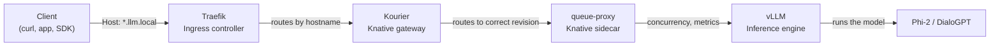

# model-deployment

Deploy and serve Large Language Models (LLMs) on a Kubernetes cluster using vLLM, KServe, and Knative.

This project provides an **OpenAI-compatible API** for two models:
- [microsoft/phi-2](https://huggingface.co/microsoft/phi-2) (2.7B parameters)
- [microsoft/DialoGPT-small](https://huggingface.co/microsoft/DialoGPT-small) (117M parameters)

## Quick Links

| Page | What you will find |
|---|---|
| [Getting Started](getting-started.md) | Prerequisites, setup, and first deployment |
| [Architecture](architecture.md) | How the system works, request flow, all resources explained |
| [Technologies](technologies.md) | Deep dive into each technology and why it is used |
| [Deployment](deployment.md) | Full deployment guide (kubectl and Helm) |
| [API Reference](api-reference.md) | API endpoints, model specs, testing |
| [Configuration](configuration.md) | All configuration options explained |
| [AI-Ops Integration](ai-ops-integration.md) | Connecting ML-Ops to Envoy AI Gateway infrastructure |
| [Concepts](concepts.md) | Kubernetes and LLM concepts for beginners |
| [Glossary](glossary.md) | Terms and definitions |

## At a Glance

## Resources Deployed

The Helm chart creates these 10 Kubernetes resources:

| # | Kind | Name | Purpose |
|---|---|---|---|
| 1 | `ServiceAccount` | `llm-serviceaccount` | Identity for model pods |
| 2 | `Secret` | `llm-secrets` | Redis password + HuggingFace token |
| 3 | `ConfigMap` | `llm-config` | General LLM configuration |
| 4 | `ConfigMap` | `phi2-chat-template` | Phi-2 chat template (Jinja2) |
| 5 | `PersistentVolumeClaim` | `model-cache` | 10 GB cache for model weights |
| 6 | `Role` | `llm-role` | Permissions: read pods, endpoints, services |
| 7 | `RoleBinding` | `llm-binding` | Binds `llm-role` to `llm-serviceaccount` |
| 8 | `InferenceService` | `vllm-phi2` | Phi-2 model deployment |
| 9 | `InferenceService` | `vllm-dialogpt` | DialoGPT model deployment |
| 10 | `IngressRoute` | `llm-ingress` | Traefik routing rules |

See [Architecture → Resources](architecture.md#resources-deployed) for details on each.

## What This Project Does

1. Takes a HuggingFace model (Phi-2 or DialoGPT-small)
2. Wraps it in a vLLM inference engine that provides an OpenAI-compatible API
3. Deploys it on Kubernetes using KServe (for model orchestration) and Knative (for autoscaling)
4. Routes traffic through Traefik (ingress) and Kourier (Knative gateway)
5. Provides health checks, probes, and resource limits for production readiness
