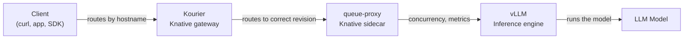

# model-deployment

Deploy and serve Large Language Models (LLMs) on a Kubernetes cluster using vLLM, KServe, and Knative.

This project provides an **OpenAI-compatible API** for models defined in the Helm chart's `inferenceServices` configuration.

## Quick Links

| Page | What you will find |
|---|---|
| [Getting Started](getting-started.md) | Prerequisites, setup, and first deployment |
| [Architecture](architecture.md) | How the system works, request flow, all resources explained |
| [Technologies](technologies.md) | Deep dive into each technology and why it is used |
| [Deployment](deployment.md) | Full deployment guide (Helm) |
| [API Reference](api-reference.md) | API endpoints, model specs, testing |
| [Configuration](configuration.md) | All configuration options explained |
| [AI-Ops Integration](ai-ops-integration.md) | Connecting ML-Ops to Envoy AI Gateway infrastructure |
| [Concepts](concepts.md) | Kubernetes and LLM concepts for beginners |
| [Glossary](glossary.md) | Terms and definitions |

## At a Glance

```mermaid
flowchart LR
    C["Client<br/>(curl, app, SDK)"]
    K["Kourier<br/>Knative gateway"]
    QP["queue-proxy<br/>Knative sidecar"]
    V["vLLM<br/>Inference engine"]

    C -->|"routes by hostname"| K
    K -->|"routes to correct revision"| QP
    QP -->|"concurrency, metrics"| V
    V -->|"runs the model"| M["LLM Model"]
```

## Resources Deployed

The Helm chart creates these resource categories:

| # | Kind | Provider | Purpose |
|---|---|---|---|
| 1 | `ConfigMap` | bjw-s (native) | Phi-2 chat template (Jinja2) |
| 2 | `PersistentVolumeClaim` | bjw-s (native) | Model weight cache |
| 3 | `ClusterRole`/`ClusterRoleBinding` | bjw-s (native) | cert-manager RBAC |
| 4 | `ConfigMap` | Custom template | Knative cert-manager config |
| 5 | `ConfigMap` | Custom template | CA trust bundle (knative-serving, kourier-system) |
| 6 | `ClusterIssuer`/`Certificate` | Custom template | Optional local CA bootstrap |
| 7 | `ServingRuntime` | Custom template | vLLM runtime definition |
| 8 | `InferenceService` | Custom template | Model deployment |
| 9 | `NetworkPolicy` | bjw-s (native) | Security rules (optional) |
| 10 | `PodDisruptionBudget` | bjw-s (rawResource) | HA (optional) |
| 11 | `PriorityClass` | bjw-s (rawResource) | Workload scheduling (optional) |
| 12 | `ServiceMonitor` | bjw-s (native) | Prometheus scraping (optional, requires CRDs) |
| 13 | `PrometheusRule` | bjw-s (rawResource) | Alerting rules (optional, requires CRDs) |

See [Architecture → Resources](architecture.md#resources-deployed) for details on each.

## What This Project Does

1. Takes a HuggingFace model (configurable via `inferenceServices`)
2. Wraps it in a vLLM inference engine that provides an OpenAI-compatible API
3. Deploys it on Kubernetes using KServe (model orchestration) and Knative (autoscaling)
4. Routes traffic through Kourier (Knative gateway)
5. Manages TLS certificates via cert-manager (optional)
6. Provides observability via Prometheus scraping, OTel, and autoscaling metrics (optional)
