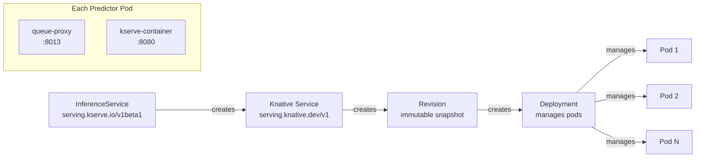
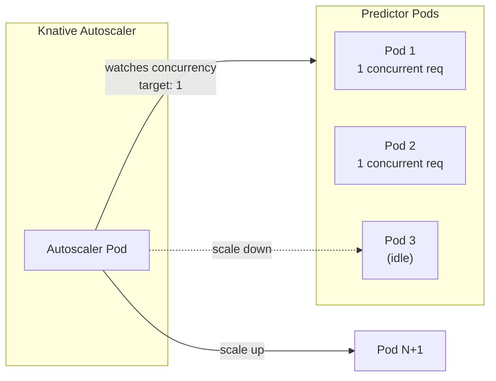
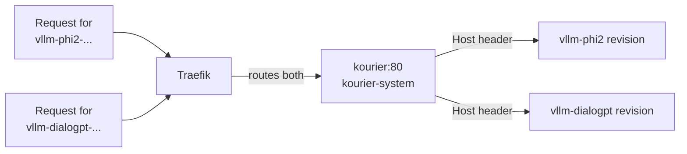
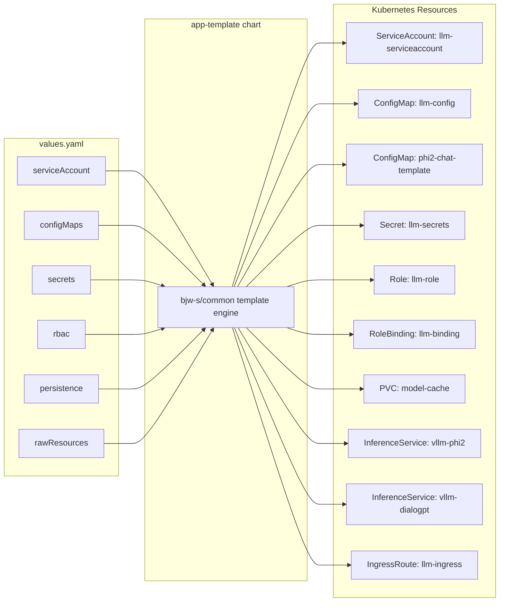

# Technologies

This page explains each technology in the stack: what it is, why it is used, and how it fits into the system.

---

## vLLM

**What it is**: A high-performance inference engine for Large Language Models.

**Official site**: [https://github.com/vllm-project/vllm](https://github.com/vllm-project/vllm)

### Why vLLM?

Traditional LLM inference has a major memory problem. During text generation, the model needs to remember all previously generated tokens (the "KV cache"). This cache grows with each token and wastes a lot of memory.

vLLM solves this with **PagedAttention** — a memory management technique borrowed from operating systems. Just as virtual memory breaks programs into pages, PagedAttention breaks the KV cache into blocks that can be stored non-contiguously. This:

- **Reduces memory waste** by 60-80%
- **Enables larger batch sizes** (more concurrent users)
- **Increases throughput** (tokens per second)

### How we use it

```bash
# The vLLM engine runs as the kserve-container in each predictor pod
vllm serve microsoft/phi-2 \
  --host 0.0.0.0 \
  --port 8080 \
  --device cpu \
  --dtype float32 \
  --max-model-len 2048
```

Configuration reference:

| Flag | Our Value | Meaning |
|---|---|---|
| `--host` | `0.0.0.0` | Listen on all network interfaces |
| `--port` | `8080` | Container port (matches what KServe expects) |
| `--device` | `cpu` | Run on CPU (no GPU required) |
| `--dtype` | `float32` | 32-bit floating point precision |
| `--max-model-len` | `2048` (phi2) / `1024` (dialogpt) | Maximum sequence length |

### Image

We use `substratusai/vllm:main-cpu` — a community build optimized for CPU inference. The official vLLM image (`vllm/vllm-openai`) is GPU-only.

---

## KServe

**What it is**: A Kubernetes custom resource definition (CRD) and controller for serving machine learning models.

**Official site**: [https://kserve.github.io](https://kserve.github.io)

### Why KServe?

Deploying an LLM manually requires creating multiple Kubernetes resources: a Deployment, Service, ConfigMap, HorizontalPodAutoscaler, etc. KServe simplifies this with a single resource — the **InferenceService** — that generates all the underlying resources automatically.

When you create an InferenceService, KServe:

1. Creates a **Knative Service** (which creates a Revision, which creates a Deployment)
2. Sets up the **predictor pod** with the model container
3. Configures **autoscaling** via Knative
4. Manages **rolling updates** when the model configuration changes
5. Provides **health checking** and readiness gates

### How KServe works under the hood



Each InferenceService gets its own Knative Service, which gets its own set of pods. This isolation means:

- Models scale independently
- Model A can have 3 replicas while Model B has 1
- Updating Model A does not affect Model B

### InferenceService spec

```yaml
predictor:
  containers:
    - name: kserve-container
      image: substratusai/vllm:main-cpu
      args: ["--model", "microsoft/phi-2", ...]
      ports:
        - containerPort: 8080
          name: http1
      resources:
        requests:
          cpu: "4"
          memory: "8Gi"
```

The container **must** be named `kserve-container`. This is how KServe identifies the model container versus sidecars.

---

## Knative Serving

**What it is**: A serverless platform built on Kubernetes that provides autoscaling, revision management, and traffic routing.

**Official site**: [https://knative.dev](https://knative.dev)

### Why Knative?

LLM serving has a unique traffic pattern: you might have zero requests for hours, then suddenly get a burst. A traditional Deployment wastes resources running idle pods. Knative solves this:

- **Scale to zero** — When there are no requests, pods scale to zero (we disable this with `minScale: 1`)
- **Scale from zero** — When a request arrives, Knative routes through the "activator" which buffers the request while a new pod starts
- **Revision tracking** — Every configuration change creates a new revision. Previous revisions remain available for rollback
- **Traffic splitting** — Send 90% traffic to new revision and 10% to old (canary deployments)

### Key Concepts

| Concept | What it means |
|---|---|
| **Service** | Top-level resource managing a model deployment |
| **Revision** | An immutable configuration snapshot (created on every change) |
| **Configuration** | Desired state for the revision |
| **Route** | Traffic routing rules (which revision gets how much traffic) |
| **Activator** | Shared component that buffers requests when scaling from zero |

### Autoscaling



```yaml
annotations:
  autoscaling.knative.dev/minScale: "1"
  autoscaling.knative.dev/maxScale: "3"
  autoscaling.knative.dev/target: "1"
```

The autoscaler works on **concurrency** (not CPU or memory):

- When a pod has 1 active request → autoscaler adds another pod
- At `maxScale: 3`, the system handles 3 concurrent requests
- If all pods are full, additional requests are queued

---

## Traefik (k3s Ingress)

**What it is**: A modern HTTP reverse proxy and load balancer. Default ingress in k3s.

**Official site**: [https://traefik.io](https://traefik.io)

### Why Traefik?

k3s includes Traefik pre-installed. It handles:

- **Host-based routing** — Routes traffic based on the `Host` header
- **TLS termination** — Handles HTTPS certificates
- **Load balancing** — Distributes traffic across service endpoints
- **Middleware** — Rate limiting, authentication, header manipulation

### IngressRoute

Instead of the standard Kubernetes Ingress, Traefik uses a custom `IngressRoute` resource:

```yaml
apiVersion: traefik.io/v1alpha1
kind: IngressRoute
metadata:
  name: llm-ingress
spec:
  entryPoints:
    - web
  routes:
    - match: Host(`vllm-phi2-predictor.llm-system.llm.local`)
      services:
        - name: kourier
          namespace: kourier-system
          port: 80
    - match: Host(`vllm-dialogpt-predictor.llm-system.llm.local`)
      services:
        - name: kourier
          namespace: kourier-system
          port: 80
```



---

## Kourier (Knative Gateway)

**What it is**: A lightweight Knative ingress gateway based on Envoy.

**Official site**: [https://github.com/knative/net-kourier](https://github.com/knative/net-kourier)

### Why Kourier?

Kourier sits between Traefik and the predictor pods. It handles Knative-specific routing:

- Maps hostnames to the correct Knative Service
- Routes to the currently active revision
- Supports traffic splitting between revisions
- Integrates with Knative's autoscaling system

Kourier runs as a Deployment in the `kourier-system` namespace and exposes a ClusterIP service also named `kourier`.

---

## bjw-s/app-template

**What it is**: A general-purpose Helm chart for defining Kubernetes applications declaratively.

**Official site**: [https://github.com/bjw-s/helm-charts](https://github.com/bjw-s/helm-charts)

### Why app-template?

Instead of writing separate Helm charts for ConfigMaps, Secrets, RBAC, PVCs, and other resources, app-template lets you define everything in a single `values.yaml` file.



### How rawResources work

The `rawResources` feature embeds KServe InferenceServices and Traefik IngressRoutes (both CRDs) inside the Helm chart without needing a custom chart. The `bjw-s/common` subchart provides a `_rawResource.tpl` template that:

1. Reads the resource definition from `rawResources` in values.yaml
2. Extracts `apiVersion`, `kind`, `metadata.name`, and `spec`
3. Renders them as a standard Kubernetes resource

> **Note about `spec` nesting**: The `_rawResource.tpl` reads the `spec` field from the raw resource entry but renders its contents directly. So the values need a double `spec:` wrapper — the outer one for the template to read, the inner one to become the actual Kubernetes `spec:` field.

---

## Redis (Optional)

**What it is**: An in-memory data store used as a KV cache for LLM inference.

### Why Redis?

Repeated prompts can be cached to avoid re-running inference for identical inputs. Useful for:
- Chat systems where the same context appears repeatedly
- Batch processing with repeated prompts
- Reducing latency for common queries

> Redis is not deployed by default. Use `make deploy-cache` to deploy it separately.

---

## Prometheus (Optional)

**What it is**: An open-source monitoring and alerting system.

### Why Prometheus?

Prometheus scrapes metrics from:
- The vLLM engine (`/metrics` endpoint)
- KServe controller
- Knative components

These metrics help monitor tokens/second, latency, CPU/memory usage, and set up alerts.

> Prometheus is not deployed by default. Use `make deploy-monitoring` to deploy it separately.

---

## Next Steps

- [See the architecture](architecture.md) in action
- [Deploy the system](deployment.md)
- [Configure the deployment](configuration.md)
